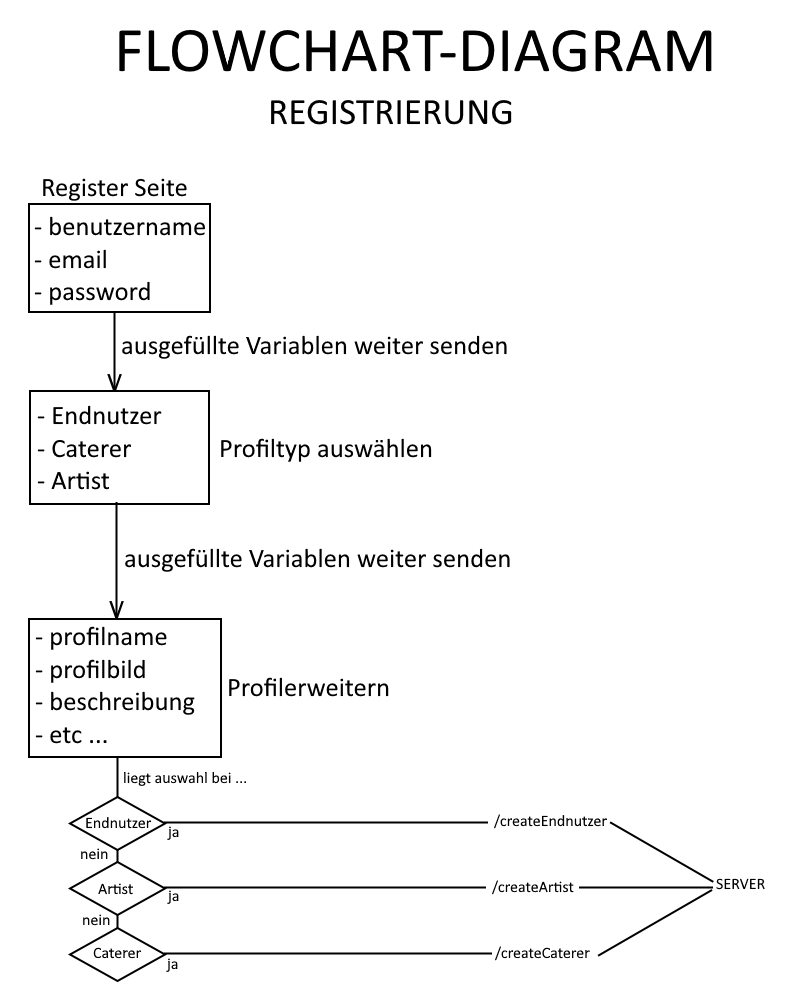

# Meeting Protokoll 

**Datum:** 11.06.24
**Dauer:** 18:00 - 19:00 Uhr

**Teilnehmer**: 
* Kirill Kuhn
* Angelo Mavridis 
* Marlon Cadell
* Luca Eberhardt
* Lucas Modesto

# Was wurde gemacht:
* in welcher Reihenfolge wird ein Nutzer angelegt?
  1. Register:
     * Benutzername
     * Email
     * Password
  2. Nutzertyp auswählen:
     * Endnutzer
     * Caterer
     * Artist
  3. Profil bearbeiten:
     * Profilname
     * Bild
     * Beschreibung
     * kurzBeschreibung
     * Region
     * Endnutzer:
       * Alter
       * Eventarten
       * Lieblingslied
       * Lieblingsgericht
       * Geschlecht
     * Artist/Caterer:
       * Preis
       * Kategorie
       * Erfahrung
  4. Informationen an den Server senden
  
