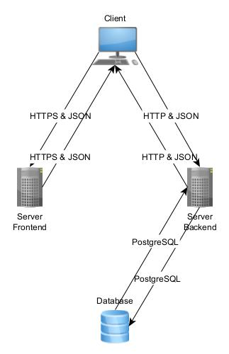
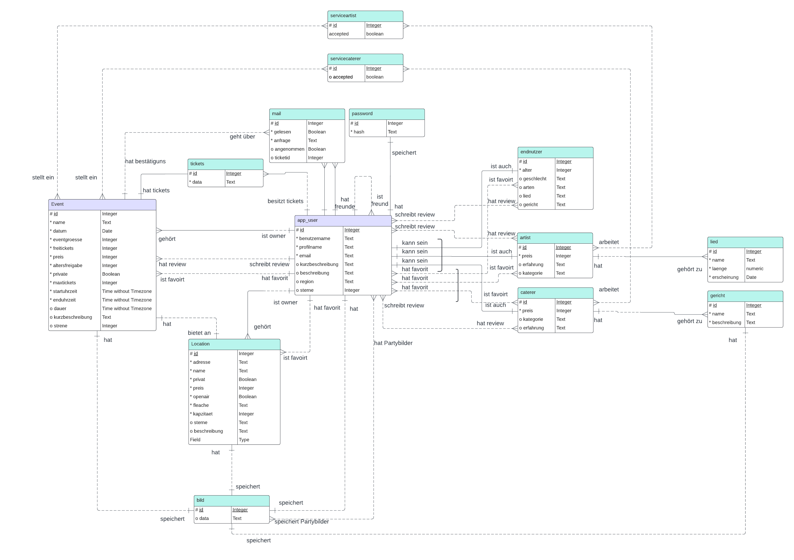

# Anforderung- und Entwurfsspezifikation

# Eventure
von
* Marlon Cadell
* Luca Eberhardt
* Lucas Modesto
* Kirill Kuhn
* Angelo Mavridis

Link zur GitHub Organisation:
https://github.com/Softwareprojekt-Vierties

---

# Inhaltsverzeichnis
1. Einführung
2. Anforderungen
    1. Stakeholder
    2. Funktionale Anforderungen
    3. Nicht-funktionale Anforderungen
        1. Rahmenbedingungen
        2. Externe Vorgaben
        3. Betriebsbedingungen
        4. Qualitätsmerkmale
    4. Graphische Benutzerschnittstelle
    5. Anforderungen im Detail
3. Technische Beschreibung
    1. Systemübersicht
    2. Softwarearchitektur
        1. Technologieauswahl
    3. Schnittstellen
    4. Datenmodell
    5. Abläufe
    6. Fehlerbehandlung
    7. Validierung
4. Projektorganisation
    1. Annahmen
    2. Verantwortlichkeiten
    3. Grober Projektplan nach Wichtigkeit sortiert
    4. Deadlines
5. Anhänge
    1. Glossar

---

# 1 Einführung

In der heutigen Zeit ist die **Organisation von Events** oft fragmentiert und erfolgt über verschiedene Kanäle wie **Facebook**, **Twitter** und **WhatsApp**. Diese **Zersplitterung** führt zu einer unübersichtlichen Erfahrung für **Veranstalter**, **Teilnehmer** und **Dienstleister**. Mit **Eventure** wollen wir diese Herausforderungen angehen und eine **zentrale Plattform** schaffen, die das **Erstellen**, **Verwalten** und **Erleben von Events** revolutioniert.

**Eventure** ist eine **innovative Plattform**, die alle Aspekte der **Eventorganisation** in einem integrierten **Ökosystem** vereint. Sie bietet eine umfassende Lösung für **Eventbesucher**, **DJs**, **Bands**, **Eventveranstalter** und **Catering-Unternehmen**. Nutzer können auf **Eventure** **öffentliche** und **private Veranstaltungen** entdecken, planen und daran teilnehmen. Die Plattform ermöglicht es, alle notwendigen **Ressourcen** und **Dienstleistungen** an einem Ort zusammenzuführen, von der **Eventerstellung** und **Ticketverkauf** bis hin zur **Gästelistenverwaltung** und **Echtzeit-Kommunikation**.

Ein wesentlicher Bestandteil von **Eventure** ist der **Marktplatz**, auf dem **Musiker**, **Caterer** und **Locations** ihre Dienste präsentieren und direkt von den Veranstaltern gebucht werden können. Durch die Integration einer **Email-Funktion** können Nutzer ihre **Veranstaltungen leicht mit Freunden teilen** und planen. Die Plattform unterstützt auch das **Erstellen von privaten Events** und fördert die Teilnahme an öffentlichen Veranstaltungen durch eine **leistungsfähige Suche**.

Unser Ziel ist es, die Art und Weise, wie Menschen **Events planen** und **erleben**, zu transformieren und dabei jedem die Möglichkeit zu bieten, **unvergessliche Erlebnisse** zu schaffen und zu genießen. Indem wir eine Plattform bieten, die nicht nur **benutzerfreundlich**, sondern auch **vernetzt** ist, öffnen wir neue geschäftliche Möglichkeiten für Anbieter von **Eventdienstleistungen** und schaffen eine lebendige Gemeinschaft von **Eventliebhabern**.

**Eventure** bringt Menschen und Möglichkeiten zusammen, um jeden **Anlass besonders** zu machen. Wir streben danach, nicht nur die **Veranstaltungssuche** und **-teilnahme** zu vereinfachen, sondern auch eine Gemeinschaft zu fördern, in der jeder Anlass zu einem **einzigartigen Ereignis** wird.

---

# 2 Anforderungen
## 2.1 Stakeholder

| **Funktion / Relevanz**             | **Name**                | **Kontakt / Verfügbarkeit**     | **Wissen**                                    | **Interessen / Ziele**                                        |
|-------------------------------------|-------------------------|---------------------------------|-----------------------------------------------|---------------------------------------------------------------|
| Kunde / Konsument des Produktes     | **Endnutzer**           | Die Endnutzer sind jederzeit und überall über die Plattform erreichbar, da sie sich über ihre persönlichen Geräte wie Smartphones, Tablets und Computer einloggen können. | Endnutzer haben allgemeine Kenntnisse in der Nutzung von Event-Plattformen und verstehen, wie sie Veranstaltungen finden und daran teilnehmen können. Sie sind mit digitalen Medien vertraut und nutzen diese regelmäßig, um soziale und Freizeitaktivitäten zu planen. | Die Endnutzer möchten leicht und schnell interessante Events und Veranstaltungen finden, daran teilnehmen und ihre sozialen Erlebnisse verbessern. Sie suchen eine benutzerfreundliche Plattform, die ihnen alle relevanten Informationen und Dienste in einem übersichtlichen Format bietet, sowie Möglichkeiten zur Interaktion mit anderen Teilnehmern und Veranstaltern. |
| Kunde / Serviceanbieter             | **DJs / Bands**         | DJs und Bands sind jederzeit über die Plattform verfügbar, um ihre Dienste anzubieten. Sie können ihre Profile aktualisieren, Auftritte planen und mit Veranstaltern in Kontakt treten. | DJs und Bands verfügen über umfangreiche musikalische Kenntnisse und Erfahrung im Unterhaltungsbereich. Sie verstehen, wie sie ihre Dienste präsentieren und ihre Zielgruppen ansprechen können. Zudem haben sie Erfahrung in der Live-Performance und wissen, welche technischen Anforderungen und organisatorischen Details für erfolgreiche Auftritte wichtig sind. | DJs und Bands wollen ihre Reichweite erhöhen, neue Auftrittsmöglichkeiten finden und ihr Publikum erweitern. Sie suchen eine Plattform, die ihnen hilft, ihre Musik und Dienstleistungen zu bewerben und direkt mit Veranstaltern in Kontakt zu treten. Sie möchten zudem Feedback von ihrem Publikum erhalten und ihre Präsenz in der Eventszene stärken. |
| Kunde / Serviceanbieter             | **Caterer**             | Caterer sind über die Plattform verfügbar, um ihre kulinarischen Dienstleistungen anzubieten. Sie können ihre Menüs präsentieren, Buchungen verwalten und direkt mit Veranstaltern kommunizieren. | Caterer haben umfassende Kenntnisse in der Bereitstellung kulinarischer Dienstleistungen, einschließlich Planung, Zubereitung und Präsentation von Speisen für Events. Sie kennen die unterschiedlichen kulinarischen Bedürfnisse und Vorlieben der Kunden und können maßgeschneiderte Angebote erstellen. Zudem haben sie Erfahrung im Management von Catering-Teams und der Logistik rund um die Essenslieferung. | Caterer sind daran interessiert, neue Aufträge zu generieren und ihr Geschäft auszubauen. Sie suchen eine Plattform, die ihnen hilft, ihre kulinarischen Angebote zu präsentieren, Kunden zu gewinnen und ihre Dienstleistungen effizient zu verwalten. Sie möchten ihre Reichweite erhöhen und langfristige Beziehungen zu Eventplanern und anderen Kunden aufbauen. |
| Kunde / Eventanbieter               | **Eventplaner**         | Eventplaner sind über die Plattform verfügbar, um ihre Events zu erstellen, zu verwalten und zu promoten. Sie können auf Ressourcen und Dienstleister zugreifen. | Eventplaner besitzen umfangreiche Kenntnisse in der Planung und Organisation von Veranstaltungen, einschließlich Logistik, Zeitmanagement und Koordination verschiedener Dienstleister. Sie verstehen die Bedürfnisse ihrer Zielgruppen und können maßgeschneiderte Eventkonzepte entwickeln. Zudem haben sie Erfahrung im Krisenmanagement und wissen, wie sie auf unerwartete Situationen reagieren müssen. | Eventplaner möchten den Planungsprozess vereinfachen, die Organisation ihrer Events optimieren und Zugang zu einer breiten Palette von Dienstleistern und Ressourcen erhalten. Sie suchen nach einer zentralen Plattform, die ihnen bei der effizienten Verwaltung aller Aspekte ihrer Veranstaltungen hilft. Ihr Ziel ist es, unvergessliche Erlebnisse für ihre Teilnehmer zu schaffen und ihre Events erfolgreich durchzuführen. |
| Kunde / Location Anbieter           | **Location Anbieter**   | Location Anbieter sind über die Plattform verfügbar, um ihre Räumlichkeiten anzubieten. Sie können detaillierte Beschreibungen und Bilder ihrer Locations hochladen und Buchungsanfragen verwalten. | Location Anbieter kennen sich gut mit der Vermietung und Verwaltung von Veranstaltungsräumen aus. Sie verstehen die Anforderungen und Bedürfnisse verschiedener Eventtypen und wie sie ihre Räumlichkeiten entsprechend vermarkten können. Sie haben Erfahrung im Facility Management und wissen, welche technischen und logistischen Aspekte für die Durchführung von Events wichtig sind. | Location Anbieter wollen ihre Räumlichkeiten effektiv präsentieren und vermarkten, um eine hohe Auslastung zu erreichen und ihre Einnahmen zu maximieren. Sie suchen eine Plattform, die ihnen hilft, ihre Angebote sichtbar zu machen und Buchungen zu erleichtern. Ihr Ziel ist es, langfristige Partnerschaften mit Eventplanern und anderen Dienstleistern aufzubauen und ihre Locations als erstklassige Veranstaltungsorte zu etablieren. |
| Entwickler / Betreiber              | **Plattformanbieter**   | Plattformanbieter sind über GitHub und andere Entwickler-Communities verfügbar. Sie kommunizieren über diese Plattformen und können ihre Arbeit durch regelmäßige Updates und Feedback-Schleifen koordinieren. | Plattformanbieter haben Kenntnisse in der Programmierung. Sie verstehen die technischen und funktionalen Anforderungen, um eine benutzerfreundliche und leistungsfähige Plattform zu schaffen. | Die Plattformanbieter möchten eine robuste und vielseitige Plattform entwickeln, die sowohl für Nutzer als auch für Dienstleister attraktiv ist. Ihr Ziel ist es, eine innovative Lösung zu bieten, die die Eventorganisation revolutioniert, und gleichzeitig Einnahmen durch die Bereitstellung der Plattform zu generieren. Sie streben danach, die Benutzererfahrung kontinuierlich zu verbessern und die Plattform an die sich ändernden Bedürfnisse des Marktes anzupassen. |

Diese detaillierte **Stakeholder-Analyse** bietet einen umfassenden Überblick über die verschiedenen **Interessengruppen** von **Eventure**, ihre spezifischen **Kenntnisse**, **Interessen** und **Ziele**. Sie ist entscheidend für die erfolgreiche **Entwicklung** und den **Betrieb** der Plattform, da sie dabei hilft, die **Bedürfnisse** und **Erwartungen** aller Beteiligten zu verstehen und zu erfüllen.

---

## 2.2 Funktionale Anforderungen

* Use Case Diagram - Eventure

## 2.2 Funktionale Anforderungen

| **Wer** | **Was** | **Warum** | **Titel** |
|---|---|---|---|
| **Eventteilnehmer** | Eventteilnehmer können an Events teilnehmen, die auf der Plattform verfügbar sind. Dies umfasst sowohl öffentliche Events, die für alle sichtbar sind, als auch private Events, zu denen sie eine Info erhalten haben. Sie können sich für Events registrieren, Tickets kaufen und detaillierte Informationen über die Veranstaltung einsehen, wie z.B. Veranstaltungsort, Zeitplan, und spezielle Anweisungen des Veranstalters. Zudem erhalten sie Benachrichtigungen über die Eventinfos und zusätzliche Informationen, die für die Teilnehmer relevant sind. | Eventteilnehmer möchten an verschiedenen Events teilnehmen, um ihre sozialen Aktivitäten zu bereichern, neue Erfahrungen zu sammeln und sich mit Freunden und der Community zu vernetzen. Die Möglichkeit, einfach und schnell an Events teilzunehmen, ist ein zentraler Anreiz für die Nutzung der Plattform. Außerdem möchten sie eine einfache Möglichkeit haben, ihre Tickets zu verwalten, Erinnerungen zu erhalten und über Eventänderungen informiert zu werden. Dies erhöht ihre Zufriedenheit und Bindung an die Plattform. | **Eventteilnahme** |
| **Eventteilnehmer** | Eventteilnehmer können ein persönliches Profil auf der Plattform erstellen, um ihre Teilnahme an Events zu verwalten und ihre Präferenzen zu speichern. In diesem Profil können sie ihre persönlichen Informationen, wie Name, Informationen, Partybilder und Interessen, angeben. Sie können auch zukünftige Events, an denen sie teilnehmen werden, einsehen und verwalten. Das Profil ermöglicht es den Teilnehmern, sich mit anderen Nutzern zu vernetzen, Freunde einzuladen und ihre sozialen Netzwerke zu erweitern. | Ein persönliches Profil ermöglicht es Eventteilnehmern, ihre Aktivitäten auf der Plattform zu verfolgen, Einladungen zu erhalten und an Events teilzunehmen. Es hilft auch dabei, die Benutzererfahrung zu personalisieren und relevante Events und Dienstleistungen vorzuschlagen. Teilnehmer können ihre Präferenzen angeben, um maßgeschneiderte Kontakte im sozialen Netzwerk zu knüpfen. Durch die Verwaltung ihrer Teilnahme und den Erhalt von Emails bleiben sie besser organisiert und können ihre Freizeit effizienter planen. | **Eventteilnehmer Profil Erstellung** |
| **Eventplaner** | Eventplaner können sich detaillierte Profile der Caterer, Location Anbieter und DJs / Bands auf der Plattform anschauen. Diese Profile enthalten umfassende Informationen über die angebotenen Dienstleistungen, Preise, Bewertungen durch andere Eventplaner und die Verfügbarkeit der Dienstleister. Eventplaner können auch Fotos, Videos und Beispielarbeiten der Dienstleister einsehen, um sich ein besseres Bild von deren Fähigkeiten und Angeboten zu machen. Sie können direkt über die Plattform Anfragen stellen, Verfügbarkeiten prüfen und Buchungen vornehmen. | Eventplaner müssen sich umfassend über die verfügbaren Dienstleister informieren, um die besten Entscheidungen für ihre Veranstaltungen zu treffen. Detaillierte Profile helfen ihnen, die Qualität und Eignung der Dienstleister zu beurteilen und passende Partner für ihre Events zu finden. Darüberhinaus, können Eventplaner sich über die Kommentarfunktion ein besseres Bild von der Qualität der Diestleister machen. Dies erleichtert den Planungsprozess und trägt zur erfolgreichen Durchführung der Veranstaltung bei. Durch die Möglichkeit, direkt über die Plattform Anfragen zu stellen und Buchungen vorzunehmen, wird der gesamte Planungsprozess effizienter und transparenter. | **Dienstleister Information** |
| **Eventplaner** | Eventplaner können neue Events auf der Plattform erstellen. Dies umfasst das Festlegen von Datum, Uhrzeit, Ort, Art der Veranstaltung, Zielgruppe und anderen relevanten Details. Sie können auch entscheiden, ob das Event öffentlich oder privat ist und wer buchen darf wird. Zusätzlich können Eventplaner spezielle Anforderungen und Anweisungen für die Teilnehmer festlegen, z.B. Dresscodes, Eintrittsbedingungen oder besondere Hygienemaßnahmen. | Die Möglichkeit, eigene Events zu erstellen, ist essenziell für Eventplaner, um ihre beruflichen und persönlichen Veranstaltungen zu organisieren und zu verwalten. Dies ermöglicht ihnen, alle Aspekte des Events von einem zentralen Punkt aus zu koordinieren und sicherzustellen, dass alle Details rechtzeitig kommuniziert werden. Durch das Versenden von Einladungen wird der Planungsprozess weiter vereinfacht. Spezielle Anforderungen und Anweisungen helfen, das Event reibungslos und nach den Vorstellungen des Planers ablaufen zu lassen. | **Event Erstellung** |
| **Eventplaner** | Eventplaner können verschiedene Dienstleister (wie Caterer, Location Anbieter und DJs / Bands) in ihre Events eintragen und deren Dienstleistungen buchen. Sie können die Verfügbarkeit der Dienstleister prüfen, Angebote vergleichen und Buchungen vornehmen. Eventplaner können auch Verträge abschließen und Zahlungen über die Plattform abwickeln. Zudem haben sie direkte Kommunikationskanäle zu Dienstleistern für Absprachen und Koordination. Eventplaner können Feedback von Dienstleistern einholen und umgekehrt, um sicherzustellen, dass alle Anforderungen und Erwartungen klar kommuniziert werden. | Indem Eventplaner Dienstleister zu ihren Events hinzufügen, können sie sicherstellen, dass alle notwendigen Ressourcen und Services vorhanden sind. Dies erleichtert die Planung und Organisation, da alle relevanten Informationen an einem Ort gesammelt werden. Es ermöglicht auch eine effizientere Kommunikation und Koordination zwischen den Eventplanern und den Dienstleistern. Durch die Möglichkeit, Zahlungen abzuwickeln, wird der gesamte Prozess transparenter und sicherer. Feedbackmechanismen tragen dazu bei, die Qualität der Zusammenarbeit zu verbessern und zukünftige Events besser zu planen. | **Dienstleister hinzufügen** |
| **Dienstleister (Bands/DJs, Caterer, Location Anbieter)** | Dienstleister können an Events als gebuchte Dienstleister teilnehmen und ihre Dienstleistungen vor Ort anbieten. Dies geschieht, wenn sie vom Eventplaner eingeladen wurden und die Einladung akzeptieren. Dienstleister können ihre Verfügbarkeit auf der Plattform verwalten, Buchungsanfragen beantworten und ihre Dienstleistungen entsprechend vorbereiten. Sie können auch spezielle Anforderungen und Wünsche der Eventplaner berücksichtigen, um ihre Dienstleistungen optimal anzupassen. Zudem haben sie die Möglichkeit, nach dem Event Feedback zu erhalten und Bewertungen zu sammeln, um ihre Dienstleistungen kontinuierlich zu verbessern. | Dienstleister profitieren davon, wenn sie ihre Dienste bei Events anbieten können, da sie so ihre Reichweite und ihren Kundenstamm erweitern. Die Möglichkeit, direkt über die Plattform gebucht zu werden, vereinfacht den Geschäftsprozess und erhöht ihre Sichtbarkeit. Sie können auch Feedback von Eventplanern und Teilnehmern erhalten, was zur Verbesserung ihrer Dienstleistungen beiträgt. Durch die Verwaltung ihrer Verfügbarkeit und die direkte Kommunikation mit den Eventplanern können sie ihre Angebote besser koordinieren und anpassen. Die Möglichkeit, Bewertungen zu sammeln, hilft ihnen, ihre Marktposition zu stärken und neue Kunden zu gewinnen. | **Dienstleister** |
| **Dienstleister** | Dienstleister können ein detailliertes Profil auf der Plattform erstellen. Dieses Profil enthält umfassende Informationen über ihre Dienstleistungen, Preise, Verfügbarkeit, Bewertungen und Referenzen. Sie können auch Fotos und Videos hochladen, um ihre Angebote visuell zu präsentieren. Durch das Sammeln und Veröffentlichen von Bewertungen können Dienstleister das Vertrauen potenzieller Kunden gewinnen. Dienstleister können auch spezielle Angebote und Rabatte auf der Plattform präsentieren, um neue Kunden zu gewinnen und langfristige Partnerschaften aufzubauen. Sie haben die Möglichkeit, ihre Profile regelmäßig zu aktualisieren und neue Dienstleistungen oder Produkte hinzuzufügen. | Ein aussagekräftiges Profil hilft Dienstleistern, sich effektiv zu vermarkten und ihre Dienstleistungen einem breiten Publikum vorzustellen. Dies trägt zur Steigerung ihrer Bekanntheit und zur Gewinnung neuer Kunden bei. Durch die Bereitstellung umfassender Informationen können sie das Vertrauen potenzieller Kunden gewinnen und sich von der Konkurrenz abheben. Die visuelle Präsentation ihrer Angebote durch Fotos und Videos erleichtert potenziellen Kunden die Entscheidung. Spezielle Angebote und Rabatte können dazu beitragen, neue Kunden anzuziehen und bestehende Beziehungen zu festigen. Regelmäßige Aktualisierungen des Profils ermöglichen es den Dienstleistern, stets aktuelle und relevante Informationen bereitzustellen. | **Dienstleister Profil Erstellung** |

---

### 2.2.1 Akteure

* **Eventteilnehmer**: Eventteilnehmer nehmen als Konsumenten an Events teil. Sie können an verschiedenen Veranstaltungen teilnehmen, die auf der Plattform verfügbar sind. Dies umfasst sowohl **öffentliche Events**, die für alle sichtbar sind, als auch **private Events**, zu denen sie eine **Info** erhalten haben. Eventteilnehmer können sich für Events **registrieren**, **Tickets kaufen** und detaillierte Informationen über die Veranstaltung einsehen, wie z.B. Veranstaltungsort, Zeitplan und spezielle Anweisungen des Veranstalters. Zudem erhalten sie **Benachrichtigungen** über die **Eventinfos** und zusätzliche Informationen, die für die Teilnehmer relevant sind. Ein persönliches **Profil** auf der Plattform ermöglicht es ihnen, ihre **Teilnahme an Events zu verwalten**, ihre **Präferenzen zu speichern** und sich mit anderen Nutzern zu **vernetzen**, Freunde **einzuladen** und ihre **sozialen Netzwerke** zu erweitern. Sie können persönliche Informationen wie **Name, Kontaktinformationen, Partybilder und Interessen** angeben und zukünftige Events einsehen und verwalten.

* **Eventplaner**: Eventplaner erstellen und verwalten Events für Eventteilnehmer. Sie können neue Events auf der Plattform **anlegen**, indem sie Details wie **Datum, Uhrzeit, Ort, Art der Veranstaltung und Zielgruppe** festlegen. Eventplaner haben die Möglichkeit, ihre Events entweder **öffentlich zugänglich** zu machen oder als **private Veranstaltungen** zu kennzeichnen und Einladungen an ausgewählte Teilnehmer zu **versenden**. Zusätzlich können sie spezielle **Anforderungen und Anweisungen** für die Teilnehmer festlegen, wie z.B. **Dresscodes, Eintrittsbedingungen oder besondere Hygienemaßnahmen**. Eventplaner können auch verschiedene **Dienstleister** zu ihren Events hinzufügen, indem sie deren detaillierte Profile einsehen, die umfassende Informationen über die **angebotenen Dienstleistungen, Preise, Bewertungen** durch andere Eventplaner und die **Verfügbarkeit** der Dienstleister enthalten. Sie können direkt über die Plattform **Anfragen stellen, Verfügbarkeiten prüfen und Buchungen** vornehmen. Die Plattform ermöglicht es ihnen, **Verträge abzuschließen, Zahlungen zu verwalten** und direkt mit den Dienstleistern zu **kommunizieren**, um die **Zusammenarbeit und Koordination** zu erleichtern. Eventplaner können **Feedback** von Dienstleistern einholen und umgekehrt, um sicherzustellen, dass alle Anforderungen und Erwartungen klar kommuniziert werden.

* **Dienstleister**: Dienstleister auf der Plattform umfassen **Bands, DJs, Caterer und Location Anbieter**. Sie bieten ihre Dienstleistungen für verschiedene Events an und können detaillierte **Profile erstellen**, um ihre **Angebote zu präsentieren**. Diese Profile enthalten umfassende Informationen über ihre **Dienstleistungen, Preise, Verfügbarkeit, Bewertungen und Referenzen**. Dienstleister erhalten **Einladungen von Eventplanern**, um ihre Dienste für bestimmte Events anzubieten. Erst nachdem sie diese Einladungen **akzeptiert** haben, werden sie offiziell als Dienstleister für das jeweilige Event gebucht und sind für die Bereitstellung ihrer Dienstleistungen zuständig. Dienstleister können ihre **Verfügbarkeit auf der Plattform verwalten**, Buchungsanfragen **beantworten** und sich auf ihre Aufgaben **vorbereiten**. Sie können spezielle **Anforderungen und Wünsche** der Eventplaner berücksichtigen, um ihre Dienstleistungen optimal anzupassen. Zudem haben sie die Möglichkeit, nach dem Event **Feedback zu erhalten und Bewertungen zu sammeln**, um ihre Dienstleistungen kontinuierlich zu verbessern. Dienstleister können auch spezielle **Angebote und Rabatte** auf der Plattform präsentieren, um **neue Kunden zu gewinnen** und **langfristige Partnerschaften** aufzubauen. Regelmäßige **Aktualisierungen des Profils** ermöglichen es ihnen, stets aktuelle und relevante Informationen bereitzustellen.

---

### 2.3 Nicht-funktionale Anforderungen

#### 2.3.1 Rahmenbedingungen

**Standards**

Die Plattform muss ein konsistentes und **benutzerfreundliches Design** aufweisen, das auf allen Geräten ansprechend dargestellt wird. Dies umfasst die Einhaltung von **Designprinzipien** wie einheitliche Farb- und Schriftgestaltung, intuitive Navigation und klare Layouts. Darüber hinaus muss die Plattform **barrierefrei** sein, um sicherzustellen, dass Menschen mit Behinderungen die Plattform problemlos nutzen können. Dies beinhaltet die Implementierung von Funktionen wie **Screenreader-Kompatibilität, Tastaturnavigation** und ausreichende **Kontraste** zwischen Text und Hintergrund.

**Hardware**

Für Endnutzer: Die Plattform muss auf Geräten zugänglich sein, die auf das Web zugreifen können, wie **Smartphones, Tablets und Desktop-Computer**. Die Benutzeroberfläche muss für **mobile Geräte** optimiert sein, um eine reibungslose und intuitive Bedienung zu ermöglichen.

Für den Server: Der Server muss **Anfragen innerhalb von maximal einer Sekunde verarbeiten** und **Antworten innerhalb von maximal zwei Sekunden** liefern. Der Server muss **skalierbar** sein, um zukünftiges Wachstum und erhöhte Nutzungsanforderungen zu bewältigen. Der Server muss eine hohe **Verfügbarkeit (99,9% Uptime)** aufweisen.

Für die Datenbank: Die Datenbank muss eine hohe **Speicherkapazität** aufweisen, mindestens 1 GB, um die Speicherung von **Profilbildern, Hintergrundbildern von Profilen und anderen Mediendaten** zu ermöglichen. Die Datenbank muss eine hohe Leistung und schnelle Zugriffszeiten bieten, um eine effiziente **Datenverwaltung und -abfrage** zu gewährleisten. Sie muss regelmäßig gesichert werden, um **Datenverlust** zu vermeiden, und **skalierbar** sein, um zukünftiges Wachstum und erhöhte Datenmengen zu unterstützen.

**Protokolle und Middleware-Komponenten**

**Kommunikationsprotokolle**: HTTP (HyperText Transfer Protocol) und HTTPS (HTTP Secure) sind die grundlegenden Protokolle, die zur Kommunikation zwischen Client und Server verwendet werden. HTTP ist ein zustandsloses Protokoll, das Anfragen vom Client an den Server sendet und Antworten zurückgibt. HTTPS ist die sichere Version von HTTP und verwendet **SSL/TLS**, um die Datenübertragung zu **verschlüsseln**, was die **Sicherheit** der übertragenen Daten gewährleistet. In deinem Projekt dienen HTTP/HTTPS dazu, **RESTful API-Endpunkte** zu definieren, über die Clients Daten an den Server senden und von ihm empfangen können.

**Middleware-Komponenten**: **Express** ist ein populäres, leichtgewichtiges Web-Framework für **Node.js**, das die Erstellung von Webanwendungen und APIs vereinfacht. Es bietet eine einfache Möglichkeit, HTTP-Server zu erstellen und Routing für verschiedene Endpunkte zu definieren. Express stellt eine Vielzahl von Funktionen zur Verfügung, darunter Middleware zur Verarbeitung von **Anfragen und Antworten**, Routing-Mechanismen und die Integration von Templates. In deinem Projekt wird Express verwendet, um die Serverinstanz zu erstellen, Middleware zu integrieren und die **Routing-Logik** für die API-Endpunkte zu definieren.

**CORS (Cross-Origin Resource Sharing)** ist ein Sicherheitsmechanismus, der verwendet wird, um den Zugriff auf Ressourcen auf einem Server von einer anderen Domäne aus zu steuern. Es ermöglicht Webanwendungen, die in einer Domäne geladen sind, sicher mit Ressourcen aus einer anderen Domäne zu interagieren. Dies ist besonders wichtig für APIs, die von verschiedenen Client-Anwendungen aufgerufen werden können. Die CORS-Middleware in deinem Projekt sorgt dafür, dass **Anfragen von anderen Domänen** akzeptiert werden, wobei die notwendigen Sicherheitsvorkehrungen getroffen werden, um unerwünschte Zugriffe zu verhindern.

Die Kommunikation mit der **Datenbank** erfolgt über **SQL-Abfragen**, die in speziellen Modulen organisiert sind. Diese Module beinhalten Funktionen zum **Erstellen, Abrufen, Aktualisieren und Löschen** von Daten in der Datenbank. In deinem Projekt werden Module wie **CreateQueries, DeleteQueries, UpdateQueries** und **GetQueries** verwendet, um die verschiedenen Datenbankoperationen zu handhaben. Ein **Verbindungspool** wird eingesetzt, um die Datenbankverbindungen effizient zu verwalten und die Leistung zu optimieren.

**Middleware zur Anfrageverarbeitung**: Diese Middleware-Komponenten verarbeiten eingehende HTTP-Anfragen, bevor sie an die entsprechenden Routen-Handler weitergeleitet werden. Dazu gehört das **Parsen des Anforderungskörpers**, das Setzen von **HTTP-Headern** und die Implementierung von **Sicherheitsmechanismen**. Beispielsweise wird **JSON-Parser-Middleware** verwendet, um den Inhalt des Anforderungskörpers zu analysieren und in ein für die Verarbeitung geeignetes Format zu konvertieren. Zusätzlich werden **Header gesetzt**, um den Cache zu kontrollieren und die Behandlung von Inhaltsoptionen zu steuern. Diese Middleware stellt sicher, dass die Anfragen korrekt und sicher verarbeitet werden, bevor sie an die Logik des Servers weitergeleitet werden.

**Middleware zur Ratenbegrenzung**: Die Ratenbegrenzung ist eine wichtige Sicherheitsmaßnahme, die verhindert, dass ein einzelner Client den Server mit zu vielen Anfragen überlastet. Diese Middleware begrenzt die Anzahl der **gleichzeitigen Anfragen**, die von einem einzelnen Client gestellt werden können. Durch die Implementierung einer **Warteschlange pro Client** wird sichergestellt, dass nur eine bestimmte Anzahl gleichzeitiger Anfragen erlaubt ist. Wenn die Warteschlange voll ist, erhält der Client eine Antwort, die ihn auffordert, es später erneut zu versuchen. Diese Maßnahme schützt den Server vor Überlastung und **Denial-of-Service-Angriffen**, indem sie eine faire Verteilung der Ressourcen gewährleistet.

Diese Kommunikationsprotokolle und Middleware-Komponenten arbeiten zusammen,

 um sicherzustellen, dass dein Server effizient und sicher funktioniert. **HTTP/HTTPS** sorgt für die grundlegende Datenübertragung zwischen Client und Server. **Express** bietet die notwendige Infrastruktur, um einen Server zu betreiben und Anfragen zu verarbeiten. **CORS** ermöglicht den kontrollierten Zugriff von verschiedenen Ursprüngen, und die Middleware-Komponenten kümmern sich um die sichere und effiziente Verarbeitung der eingehenden Anfragen. Die **Datenbankkommunikation** wird durch spezielle Module verwaltet, die die verschiedenen Datenbankoperationen handhaben, und die **Ratenbegrenzung** schützt den Server vor Überlastung durch zu viele gleichzeitige Anfragen.

#### 2.3.2 Externe Vorgaben

Regelmäßige **Sicherheitsüberprüfungen** und **Penetrationstests** müssen durchgeführt werden, um Schwachstellen zu identifizieren und zu beheben. Eine klare und transparente **Datenschutzrichtlinie** muss bereitgestellt werden, die die Erhebung, Verwendung und Speicherung von Nutzerdaten beschreibt. Die Plattform muss eine hohe **Benutzerfreundlichkeit** gewährleisten, indem sie auf Benutzerfeedback reagiert und kontinuierlich **Verbesserungen** implementiert.

Diese nicht-funktionalen Anforderungen stellen sicher, dass die Eventure-Plattform nicht nur funktional, sondern auch **sicher, effizient und benutzerfreundlich** ist. Sie bieten die Rahmenbedingungen, um eine hohe Qualität und Zuverlässigkeit der Plattform zu gewährleisten.

---

### 2.3.2 Betriebsbedingungen

Die Vorgaben des Kunden umfassen mehrere Aspekte, um die Kompatibilität und Effizienz der Plattform Eventure sicherzustellen. Zunächst müssen die gängigsten **Webbrowser vollständig unterstützt** werden, um eine breite Nutzerschaft zu erreichen. Die Plattform muss auf der neuesten Version von **Google Chrome** sowie auf mehreren Vorgängerversionen (mindestens drei Hauptversionen zurück) einwandfrei funktionieren. Dasselbe gilt für **Microsoft Edge**, wo ebenfalls die neueste Version sowie mehrere Vorgängerversionen unterstützt werden müssen.

Da Eventure als **Webanwendung** konzipiert ist, sind die spezifischen Versionen der **Betriebssysteme** der Endnutzer nicht von entscheidender Bedeutung. Es muss jedoch gewährleistet sein, dass die Plattform auf den gängigsten Betriebssystemen reibungslos läuft, die von den unterstützten Webbrowsern verwendet werden. Dies schließt **Windows, macOS, Linux, iOS und Android** ein.

Für die Entwicklung von Eventure werden **moderne Programmiersprachen und Frameworks** verwendet, die eine hohe Leistung und ein **responsives Design** unterstützen. Im Backend kommt **Node.js** zum Einsatz, da es eine **skalierbare und effiziente** Umgebung für die Entwicklung serverseitiger Anwendungen bietet. **Express.js** dient als Web-Framework, um **Routing** und **Middleware-Integration** zu erleichtern. Zusätzlich wird **OpenRouteService** für die Bereitstellung von **Routing- und Geodaten-Diensten** genutzt. Dies ermöglicht die Berechnung von Routen und die Bereitstellung von geografischen Informationen, die für die Eventplanung und -verwaltung nützlich sind.

Im Frontend wird **Vue.js** als progressives JavaScript-Framework eingesetzt. Es eignet sich hervorragend für den Aufbau von **Benutzeroberflächen** und **Single-Page-Anwendungen** und unterstützt die Entwicklung von **responsiven Designs**, die sich an verschiedene Bildschirmgrößen und -auflösungen anpassen können. **Vue Router** wird zur Handhabung des clientseitigen Routings verwendet, während **Vuex** für die Zustandsverwaltung innerhalb der Anwendung eingesetzt wird. **Axios** wird für **HTTP-Anfragen** genutzt, um die Kommunikation zwischen dem Frontend und dem Backend zu ermöglichen. Es unterstützt alle modernen Browser und stellt sicher, dass die API-Aufrufe effizient und zuverlässig durchgeführt werden. **Leaflet**, eine Open-Source-JavaScript-Bibliothek, wird verwendet, um **interaktive Karten** in die Webanwendung zu integrieren. Leaflet bietet eine einfache Möglichkeit, Karten anzuzeigen und mit **Geodaten** zu interagieren, was besonders nützlich für die Darstellung von Eventorten und Routen ist.

**PostgreSQL** wird als **relationale Datenbank** verwendet, die für ihre Zuverlässigkeit und Leistungsfähigkeit bekannt ist. Die Datenbank kann komplexe Abfragen effizient verarbeiten und unterstützt umfangreiche Datenmengen. **Sequelize** wird als **ORM (Object-Relational Mapping)** verwendet, um die Interaktion zwischen Node.js und PostgreSQL zu vereinfachen.

Diese Vorgaben stellen sicher, dass die Plattform auf den am häufigsten verwendeten **Webbrowsern und Betriebssystemen** zuverlässig funktioniert und mit **modernen Webentwicklungstechnologien** entwickelt wird. Dies gewährleistet eine optimale Benutzererfahrung und eine skalierbare Backend-Architektur. Die Integration von **Leaflet** für interaktive Karten und **OpenRouteService** für Routing- und Geodaten-Dienste erweitert die Funktionalität der Plattform und verbessert die Benutzererfahrung erheblich.

---

### 2.3.3 Qualitätsmerkmale
* Externe Qualitätsanforderungen (z.B. Performance, Sicherheit, Zuverlässigkeit,
  Benutzerfreundlichkeit)

  | Qualitätsmerkmal           | sehr gut | gut | normal | nicht relevant |
  |----------------------------|----------|-----|--------|----------------| 
  | **Zuverlässigkeit**        |          |     |        |                |
  | Fehlertoleranz             | X        | -   | -      | -              |
  | Wiederherstellbarkeit      | X        | -   | -      | -              |
  | Ordnungsmäßigkeit          | X        | -   | -      | -              |
  | Richtigkeit                | X        | -   | -      | -              |
  | Konformität                | -        | X   | -      | -              |
  | **Benutzerfreundlichkeit** |          |     |        |                |
  | Installierbarkeit          | -        | -   | -      | X              |
  | Verständlichkeit           | X        | -   | -      | -              |
  | Erlernbarkeit              | X        | -   | -      | -              |
  | Bedienbarkeit              | X        | -   | -      | -              |
  | **Performance**            |          |     |        |                |
  | Zeitverhalten              | -        | X   | -      | -              |
  | Effizienz                  | -        | X   | -      | -              |
  | **Sicherheit**             |          |     |        |                |
  | Analysierbarkeit           | X        | -   | -      | -              |
  | Modifizierbarkeit          | -        | -   | X      | -              |
  | Stabilität                 | X        | -   | -      | -              |
  | Prüfbarkeit                | X        | -   | -      | -              |

---

## 2.4 Graphische Benutzerschnittstelle

* [Desktop Website PDF](../GUI-Mockups/Eventure.pdf)
* [Desktop Website PowerPoint](../GUI-Mockups/Eventure.pptx)
* [Mobile Website PDF](../GUI-Mockups/EventureMobile.pdf)
* [Moblie Website PowerPoint](../GUI-Mockups/EventureMobile.pptx)

---

## 2.5 Anforderungen im Detail

### Erstellen

| **Name** | **In meiner Rolle als** | **möchte ich** | **so dass** | **Erfüllt, wenn** | **Priorität** |
|:---------|:-----------------------:|:--------------|:------------|:------------------|:-------------|
| Caterer Erstellen | Caterer | einen Account erstellen, um Teil der Eventure-Plattform zu werden | ich über die Suche gefunden werden und meine Dienstleistungen anbieten kann, was mein Geschäft erweitert. | Caterer-Account erfolgreich erstellt und in der Suche auffindbar ist. | Muss |
| DJ Erstellen | DJ | einen Account erstellen, um Teil der Eventure-Plattform zu werden | ich von Eventplanern und -teilnehmern über die Suche gefunden werden und meine DJ-Dienstleistungen anbieten kann, was meine Auftragslage verbessert. | DJ-Account erfolgreich erstellt und in der Suche auffindbar ist. | Muss |
| Event Erstellen | Event Ersteller | ein neues Event erstellen, das über die Suche gefunden werden kann | ich das Event planen, alle notwendigen Details und Dienstleister hinzufügen und möglichst viele Tickets verkaufen kann, um den Erfolg des Events zu gewährleisten. | Event erfolgreich erstellt, alle Details eingetragen und in der Suche auffindbar ist. | Muss |
| Location Erstellen | zukünftiger Locationbesitzer | eine neue Location erstellen, die über die Suche gefunden werden kann | ich sie für Events anbieten und damit Geld verdienen kann, indem ich eine attraktive Beschreibung und positive Bewertungen anziehe. | Location erfolgreich erstellt, vollständig ausgefüllt und in der Suche auffindbar ist. | Muss |
| Profil Erstellen | Eventteilnehmer | eine Profilseite erstellen, die über die Suche gefunden werden kann | ich meine Partybilder teilen, mich mit Freunden vernetzen und Teil einer Community werden kann, was mein soziales Netzwerk erweitert. | Profil erfolgreich erstellt, vollständig ausgefüllt und in der Suche auffindbar ist. | Optional |

### Ansicht

| **Name** | **In meiner Rolle als** | **möchte ich** | **so dass** | **Erfüllt, wenn** | **Priorität** |
|:---------|:-----------------------:|:--------------|:------------|:------------------|:-------------|
| Caterer Ansicht | Caterer | meine Informationen und Bewertungen anzeigen lassen | ich Marketing betreiben, mein Profil stärken und zukünftige Events, an denen ich teilnehme, zeigen kann. Dadurch kann ich mehr Buchungen und Vertrauen gewinnen. | Informationen und Bewertungen sichtbar sind und zukünftige Events angezeigt werden. | Muss |
| Caterer Ansicht | Eventersteller | die Bewertungen und zukünftige Veranstaltungen eines Caterers einsehen | ich die Qualität des Caterers beurteilen und entscheiden kann, ob ich ihn für mein Event buchen möchte. | Bewertungen und Eventteilnahmen des Caterers sichtbar sind. | Muss |
| Caterer Ansicht | Eventteilnehmer | sehen, welcher Caterer bei zukünftigen Events beteiligt ist | ich weiß, welche Caterer an den Events teilnehmen, an denen ich interessiert bin, und sicherstellen kann, dass ich ein gutes Erlebnis habe. | Caterer und deren Events sind sichtbar. | Muss |
| Caterer Ansicht | Location Anbieter | die Caterer, die bei Events in meiner Location arbeiten, überprüfen | ich sicherstellen kann, dass die Caterer hochwertig sind und positive Bewertungen haben. | Caterer-Informationen und Bewertungen sind sichtbar. | Muss |
| Caterer Ansicht | DJ | Informationen über Caterer einsehen, die bei Events arbeiten, bei denen ich auflege | ich weiß, welche Caterer bei den Events sind und sicherstellen kann, dass das Catering gut ist. | Caterer-Informationen und Bewertungen sind sichtbar. | Muss |
| DJ Ansicht | DJ | meine Informationen und Bewertungen anzeigen lassen | ich Marketing betreiben, mein Profil stärken und zukünftige Events, an denen ich teilnehme, zeigen kann. Dadurch kann ich mehr Buchungen und Vertrauen gewinnen. | Informationen und Bewertungen sichtbar sind und zukünftige Events angezeigt werden. | Muss |
| DJ Ansicht | Eventersteller | die Bewertungen und zukünftige Veranstaltungen eines DJs einsehen | ich die Qualität des DJs beurteilen und entscheiden kann, ob ich ihn für mein Event buchen möchte. | Bewertungen und Eventteilnahmen des DJs sichtbar sind. | Muss |
| DJ Ansicht | Eventteilnehmer | sehen, welcher DJ bei zukünftigen Events auflegt | ich weiß, welche DJs an den Events teilnehmen, an denen ich interessiert bin, und sicherstellen kann, dass ich ein gutes Erlebnis habe. | DJ-Informationen und deren Events sind sichtbar. | Muss |
| DJ Ansicht | Location Anbieter | die DJs, die bei Events in meiner Location arbeiten, überprüfen | ich sicherstellen kann, dass die DJs hochwertig sind und positive Bewertungen haben. | DJ-Informationen und Bewertungen sind sichtbar. | Muss |
| DJ Ansicht | Caterer | Informationen über DJs einsehen, die bei Events arbeiten, bei denen ich das Catering mache | ich weiß, welche DJs bei den Events sind und sicherstellen kann, dass die Musik gut ist. | DJ-Informationen und Bewertungen sind sichtbar. | Muss |
| Location Ansicht | Location Anbieter | Informationen und Bewertungen meiner Location anzeigen lassen | ich meine Location vermarkten und mehr Buchungen anziehen kann, indem ich positive Bewertungen zeige und zukünftige Events hervorhebe. | Informationen und Bewertungen sichtbar sind und zukünftige Events angezeigt werden. | Muss |
| Location Ansicht | Eventersteller | die Bewertungen und zukünftige Veranstaltungen einer Location einsehen | ich die Qualität der Location beurteilen und entscheiden kann, ob ich sie für mein Event buchen möchte. | Bewertungen und Eventteilnahmen der Location sichtbar sind. | Muss |
| Location Ansicht | Eventteilnehmer | sehen, welche Location bei zukünftigen Events genutzt wird | ich weiß, welche Locations für die Events verwendet werden, an denen ich interessiert bin, und sicherstellen kann, dass ich ein gutes Erlebnis habe. | Location-Informationen und deren Events sind sichtbar. | Muss |
| Location Ansicht | Caterer | die Locations, die bei Events genutzt werden, bei denen ich das Catering mache, überprüfen | ich sicherstellen kann, dass die Locations hochwertig sind und positive Bewertungen haben. | Location-Informationen und Bewertungen sind sichtbar. | Muss |
| Location Ansicht | DJ | Informationen über Locations einsehen, die bei Events genutzt werden, bei denen ich auflege | ich weiß, welche Locations bei den Events sind und sicherstellen kann, dass die Venue gut ist. | Location-Informationen und Bewertungen sind sichtbar. | Muss |

### Bearbeiten

| **Name** | **In meiner Rolle als** | **möchte ich** | **so dass** | **Erfüllt, wenn** | **Priorität** |
|:---------|:-----------------------:|:--------------|:------------|:------------------|:-------------|
| Caterer Bearbeiten | Caterer | meine Catererinformationen bearbeiten und bisherige Daten aktualisieren | die Informationen aktuell bleiben und Nutzer immer den neuesten Stand sehen, was mir hilft, mein Profil kontinuierlich zu verbessern und mehr Kunden zu gewinnen. | Informationen erfolgreich aktualisiert und sichtbar sind. | Kann |
| DJ Bearbeiten | DJ | meine DJ-Informationen bearbeiten und bisherige Daten aktualisieren | die Informationen aktuell bleiben und Nutzer immer den neuesten Stand sehen, was mir hilft, mein Profil kontinuierlich zu verbessern und mehr Buchungen zu erhalten. | Informationen erfolgreich aktualisiert und sichtbar sind. | Kann |
| Event Bearbeiten | Eventersteller | Eventinformationen bearbeiten und weitere Dienstleister hinzufügen | die Informationen aktuell bleiben und bei Absagen schnell neue Dienstleister hinzugefügt werden können, um den Erfolg des Events zu sichern. | Informationen erfolgreich aktualisiert und Änderungen sichtbar sind. | Kann |
| Location Bearbeiten | Locationbesitzer | meine Locationinformationen bearbeiten und bisherige Daten aktualisieren | die Informationen aktuell bleiben und Eventplaner immer den neuesten Stand sehen, was mir hilft, meine Location attraktiv zu halten und regelmäßig gebucht zu werden. | Informationen erfolgreich aktualisiert und sichtbar sind. | Kann |
| Person Bearbeiten | Eventteilnehmer | meine Personeninformationen bearbeiten und weitere Partybilder oder andere Daten hinzufügen | die Informationen aktuell bleiben und die Plattform lebendig bleibt, was mein Profil ansprechend hält und mehr Interaktionen fördert. | Informationen und Bilder erfolgreich aktualisiert und sichtbar sind. | Kann |

### Sonstiges

| **Name** | **In meiner Rolle als** | **möchte ich** | **so dass** | **Erfüllt, wenn** | **Priorität** |
|:---------|:-----------------------:|:--------------|:------------|:------------------|:-------------|
| E-Mail Ansicht | Eventteilnehmer | meine E-Mails anzeigen lassen | ich Buchungen bestätigen, meine Tickets anzeigen lassen oder mit anderen Nutzern kommunizieren kann, was mir hilft, alle relevanten Informationen an einem Ort zu haben und schnell darauf zugreifen zu können. | E-Mails erfolgreich angezeigt und zugänglich sind. | Optional |
| E-Mail Ansicht | Location Anbieter | meine E-Mails anzeigen lassen | ich Buchungen bestätigen oder mit Eventplanern kommunizieren kann, um sicherzustellen, dass alles reibungslos verläuft. | E-Mails erfolgreich angezeigt und zugänglich sind. | Optional |
| E-Mail Ansicht | Caterer | meine E-Mails anzeigen lassen | ich Buchungen bestätigen oder mit Eventplanern kommunizieren kann, um sicherzustellen, dass alles reibungslos verläuft. | E-Mails erfolgreich angezeigt und zugänglich sind. | Optional |
| E-Mail Ansicht | DJ | meine E-Mails anzeigen lassen | ich Buchungen bestätigen oder mit Eventplanern kommunizieren kann, um sicherzustellen, dass alles reibungslos verläuft. | E-Mails erfolgreich angezeigt und zugänglich sind. | Optional |
| Event Ansicht | Eventteilnehmer | mich über ein Event informieren, welche Caterer, welche Location und welcher DJ beteiligt sind | ich entscheiden kann, ob ich ein Ticket buchen möchte, um sicherzustellen, dass das Event meinen Erwartungen entspricht und ich ein gutes Erlebnis habe. | Eventinformationen vollständig angezeigt und zugänglich sind. | Optional |
| Anmeldung | Nutzer | mich einloggen | ich Zugang zur Plattform habe und alle verfügbaren Funktionen nutzen kann, um mein Profil zu verwalten, Events zu buchen und mit anderen Nutzern zu interagieren. | Anmeldung erfolgreich und Zugang zur Plattform gewährt ist. | Muss |
| Personen Ansicht | Nutzer | Personeninformationen anzeigen lassen | ich eine Übersicht habe und mich mit anderen Personen befreunden kann, um mein soziales Netzwerk zu erweitern und interessante Kontakte zu knüpfen. | Personeninformationen erfolgreich angezeigt und zugänglich sind. | Optional |
| Registrierung | Nutzer | mich registrieren | ich einen Account auf der Plattform erstellen und alle verfügbaren Funktionen nutzen kann, um mein Profil zu erstellen, Events zu buchen und mit anderen Nutzern zu interagieren. | Registrierung erfolgreich und Account erstellt ist. | Muss |
| Suche | Nutzer | nach Events, DJs oder Caterern suchen | ich die perfekte Auswahl treffen kann und meine Vorlieben mit Hilfe der Filter berücksichtigen kann, um die besten Optionen für meine Bedürfnisse zu finden. | Suchergebnisse erfolgreich angezeigt und nach meinen Kriterien gefiltert sind. | Muss |
| Kommentar anlegen | Nutzer | einen Kommentar abgeben | ich meine Begeisterung oder meinen Unmut äußern kann, um Feedback zu geben, das anderen Nutzern und Dienstleistern hilft, ihre Angebote zu verbessern. | Kommentar erfolgreich abgegeben und sichtbar ist. | Optional |

---

# 3 Technische Beschreibung
## 3.1 Systemübersicht

Das dargestellte **Systemarchitekturdiagramm**, ein sogenanntes "Box-and-Arrow" Diagramm, liefert eine abstrahierte Übersicht über das betrachtete **Softwaresystem**. Es handelt sich um ein statisches Diagramm, das keine dynamischen Abläufe oder zeitlichen Sequenzen veranschaulicht, sondern sich auf die Darstellung der **Kommunikationsbeziehungen** und der verwendeten **Datenformate** zwischen den einzelnen **Systemkomponenten** konzentriert.

Im Diagramm sind vier zentrale **Komponenten** ersichtlich: der **Client**, der **Server-Frontend**, der **Server-Backend** und die **Datenbank**. Der Client kommuniziert sowohl mit dem **Server-Frontend** als auch mit dem **Server-Backend** über die Protokolle **HTTPS** und **JSON** sowie **HTTP** und **JSON**. Eine weitere Kommunikation findet zwischen dem **Server-Frontend** und dem **Server-Backend** über **HTTPS** und **JSON** statt. Zusätzlich besteht eine direkte Verbindung zwischen dem **Server-Backend** und der **Datenbank** über das **Datenbankmanagementsystem PostgreSQL**.

Die Verwendung von **Protokollen** wie HTTP und HTTPS sowie des Datenformats JSON impliziert, dass das System auf einer **webbasierten Kommunikationsinfrastruktur** basiert. Die Nutzung von **PostgreSQL** zur **Datenbankanbindung** deutet auf den Einsatz eines **relationalen Datenbankmanagementsystems** hin, welches für die **Datenspeicherung und -verwaltung** eingesetzt wird.

---

## 3.2 Softwarearchitektur

Die Softwarearchitektur beschreibt die Verteilung der Softwarebausteine auf verschiedene Rechnerknoten sowie deren Interaktion. In dieser Darstellung wird die Software sowohl auf dem Client als auch auf dem Server in verschiedene Schichten unterteilt, wobei jede Schicht spezifische Aufgaben übernimmt und die Abhängigkeiten stets unidirektional von "oben" nach "unten" verlaufen.

Auf dem Server sind drei Hauptschichten identifizierbar: Die **Web-Schicht** ist für die Verwaltung der HTTP-Anfragen zuständig. Sie nimmt Anfragen von den Clients entgegen und leitet diese an die Logik-Schicht weiter. Die **Logik-Schicht**, implementiert in JavaScript, verarbeitet die Geschäftslogik und steuert den Datenfluss zwischen verschiedenen Modulen. Zu den in der Logik-Schicht enthaltenen Modulen gehören der RequestHandler, welcher als zentrale Anlaufstelle für Anfragen dient, der LocationHandler zur Verwaltung von Standortdaten, der AccountHandler zur Verwaltung von Benutzerkonten, der ServiceHandler zur Verwaltung von Diensten, der LoginHandler für Authentifizierung und Registrierung sowie der MessageHandler zur Verwaltung von Nachrichten. Die **Persistenz-Schicht** ist verantwortlich für die Speicherung und Verwaltung der Daten und kommuniziert direkt mit der Datenbank.

* Architektur

Auf dem Client sind ebenfalls drei Schichten präsent: Die **View-Schicht** stellt die Präsentationsschicht dar und ist für die Darstellung der Benutzeroberfläche verantwortlich, wobei Technologien wie HTML und CSS zum Einsatz kommen. Die **Logik-Schicht** auf dem Client verarbeitet die Anwendungslogik, implementiert die Geschäftslogik und steuert die Interaktion zwischen der View-Schicht und der Kommunikation-Schicht. Die **Kommunikations-Schicht** ist für die Kommunikation mit dem Server verantwortlich und nutzt dabei Technologien wie HTTPS, JSON Web Token und JSON.

Die Interaktion zwischen Client und Server erfolgt in einem unidirektionalen Fluss von "oben" nach "unten". Der Prozess beginnt mit dem Senden einer Anfrage (Query) durch den Client an den Server. Der Server empfängt die Anfrage in der Web-Schicht, verarbeitet diese in der Logik-Schicht und ruft die erforderlichen Daten aus der Persistenz-Schicht ab. Die Datenbank antwortet mit den angeforderten Daten, die der Server schließlich an den Client zurücksendet. Der Client empfängt die Antwort und aktualisiert entsprechend die View-Schicht. 

* Kommunikation zwischen Client und Server

Dieses Architekturmodell gewährleistet, dass jede Schicht ihre spezifischen Aufgaben erfüllt und die Abhängigkeiten klar und unidirektional bleiben. Die detaillierte Aufteilung der Schichten geht über die allgemeine Systemübersicht hinaus und ermöglicht eine feinere Granularität der Softwarebausteine.

---

### 3.2.1 Technologieauswahl

In diesem Abschnitt wird die Auswahl der im Projekt verwendeten Frameworks, Technologien, Bibliotheken, Datenformate und Protokolle ausführlich dargestellt. Diese technische Basis bildet das Fundament der entwickelten Anwendung und stellt sicher, dass die Anforderungen hinsichtlich Effizienz, Skalierbarkeit und Sicherheit erfüllt werden.

### Framework

Für die Entwicklung der Benutzeroberfläche und der clientseitigen Logik wurde **Vue.js** gewählt. Vue.js ist ein fortschrittliches JavaScript-Framework, das sich durch seine Modularität und Flexibilität auszeichnet. Es ermöglicht die Entwicklung reaktiver Benutzeroberflächen, die sich dynamisch an Benutzerinteraktionen und Datenänderungen anpassen. Die komponentenbasierte Architektur von Vue.js fördert eine saubere und wartbare Codebasis, wodurch die Entwicklung komplexer Anwendungen erleichtert wird.

### Technologien

Zur Verwaltung der Datenbank wurde **PostgreSQL Version 16** eingesetzt. PostgreSQL ist ein objektrelationales Datenbankmanagementsystem, das für seine Robustheit, Skalierbarkeit und umfangreiche Funktionalitäten bekannt ist. Die Entscheidung für PostgreSQL beruht auf dessen Fähigkeit, komplexe Datenstrukturen effizient zu handhaben und gleichzeitig hohe Datenintegrität und Sicherheit zu gewährleisten. Die Version 16 bietet erweiterte Leistungsmerkmale und zusätzliche Funktionen, die die Verwaltung und Verarbeitung großer Datenmengen optimieren.

### Datenformate

Im Rahmen des Projekts werden verschiedene Datenformate verwendet, um eine effiziente und sichere Datenübertragung zu gewährleisten:

- **JSON (JavaScript Object Notation)** dient als primäres Datenformat für die Kommunikation zwischen Client und Server. JSON ist ein leichtgewichtiges und plattformunabhängiges Format, das für seine Einfachheit und Lesbarkeit geschätzt wird. Es ermöglicht die strukturierte Übertragung von Daten, die sowohl von Menschen als auch von Maschinen leicht verarbeitet werden können.

- **JSON Web Token (JWT)** wird zur Authentifizierung und Autorisierung verwendet. JWT ist ein kompaktes und URL-sicheres Token-Format, das Informationen zwischen zwei Parteien auf sichere Weise übermittelt. Es stellt sicher, dass die übertragenen Daten authentisch und unverändert sind, und wird insbesondere in Single-Page-Anwendungen (SPA) eingesetzt, um die Sicherheit und Integrität der Benutzersitzungen zu gewährleisten.

### Protokolle

Die Kommunikation zwischen Client und Server erfolgt über das **HTTP (Hypertext Transfer Protocol)**. HTTP ist das zentrale Protokoll des World Wide Web und ermöglicht die Übertragung von Daten zwischen Webbrowsern und Webservern. Es ist zustandslos und ermöglicht eine Anfrage-Antwort-Kommunikation, die für die Funktionalität von Webanwendungen unerlässlich ist. Im vorliegenden Projekt wird HTTP verwendet, um RESTful API-Endpunkte bereitzustellen, die es den Clients ermöglichen, Daten sicher zu senden und zu empfangen.

### Zusammenfassung

Die sorgfältige Auswahl von Vue.js, PostgreSQL, JSON, JWT und HTTP stellt eine solide und effiziente technische Grundlage für das Projekt dar. Vue.js ermöglicht die Entwicklung interaktiver und benutzerfreundlicher Oberflächen, während PostgreSQL als zuverlässige und leistungsfähige Datenbanklösung dient. JSON und JWT gewährleisten eine sichere und effiziente Datenübertragung und Authentifizierung, und HTTP fungiert als grundlegendes Kommunikationsprotokoll, das die Interaktion zwischen Client und Server ermöglicht. Diese Technologien und Standards wurden ausgewählt, um den hohen Anforderungen des Projekts hinsichtlich Skalierbarkeit, Wartbarkeit und Sicherheit gerecht zu werden und eine nachhaltige und zukunftsfähige Lösung zu bieten.

---

## 3.3 Schnittstellen

### Schnittstellenbeschreibung (API)

Dieser Abschnitt beschreibt die wesentlichen **Schnittstellen** der Software, sowohl externe als auch interne, die eine effiziente Kommunikation und Integration der verschiedenen Komponenten gewährleisten.

Die **externen Schnittstellen** betreffen die Kommunikation mit externen Systemen, insbesondere die Interaktion zwischen **Client** und **Server** über **HTTP/HTTPS-Protokolle**. Diese Endpunkte unterstützen grundlegende **CRUD-Operationen** und ermöglichen einen sicheren Datenaustausch. Zu den wichtigsten Endpunkten gehören die **Authentifizierung** über `/login`, das **Abrufen von Benutzerinformationen** über `/getUserById/:id`, die **Erstellung neuer Events** und die **Aktualisierung von Locations**. **HTTPS** wird verwendet, um die **Datenübertragung** zu verschlüsseln, während **JSON Web Token (JWT)** für die Authentifizierung und Autorisierung sorgen.

**CORS (Cross-Origin Resource Sharing)** wird eingesetzt, um den Zugriff von Webanwendungen auf serverseitige Ressourcen zu steuern. Dies ermöglicht es, dass externe Web-Frontends, die auf verschiedenen Domänen gehostet werden, sicher auf die API zugreifen können. Die **CORS-Konfiguration** spezifiziert erlaubte Ursprünge, Methoden und Header, um die Integrität und Sicherheit der Anwendung zu gewährleisten.

Die **internen Schnittstellen** sind entscheidend für die Modularität und Wartbarkeit der Software. **Middleware-Komponenten** in der **Express-Anwendung** verarbeiten eingehende Anfragen, bevor diese an die **Routen-Handler** weitergeleitet werden. Sie übernehmen Aufgaben wie **Authentifizierung**, **Ratenbegrenzung** und **Fehlerbehandlung**. Beispielsweise wird **JSON-Middleware** zum Parsen von Anforderungskörpern und `cookie-parser` für die Verarbeitung von Cookies verwendet.

Die **Datenbankkommunikation** erfolgt über spezialisierte Module, die **SQL-Abfragen** ausführen und die **Datenbanklogik** kapseln. Diese Module, wie `CreateQueries`, `DeleteQueries`, `UpdateQueries` und `GetQueries`, bieten klar definierte Schnittstellen für **CRUD-Operationen** und tragen zu einer sauberen Trennung der Logik bei. Dies erleichtert die Wartung und Erweiterung der Anwendung erheblich.

Interne **API-Module** stellen Funktionen bereit, die von verschiedenen Teilen der Anwendung genutzt werden können. Diese modularen APIs gewährleisten eine klare Trennung der Verantwortlichkeiten. Beispiele hierfür sind das `Auth`-Modul für **Authentifizierung** und **Autorisierung** sowie das `checkDistance`-Modul zur **Berechnung von Entfernungen** zwischen geografischen Punkten.

Die **API-Definition** sollte von denjenigen erfolgen, die die Anforderungen an die API genau kennen. In einem **Client-Server-System** haben Client-Entwickler spezifische Anforderungen an die Backend-Entwickler. Daher ist es sinnvoll, dass die **Client-Entwickler** die API spezifizieren, die dann von den **Backend-Entwicklern** implementiert wird. Dieser kollaborative Ansatz stellt sicher, dass die API alle notwendigen Funktionen und Datenstrukturen bereitstellt, um die Anforderungen der **Client-Anwendung** zu erfüllen. Eine klare **Definition und Dokumentation** der Schnittstellen ermöglicht eine effiziente und reibungslose Entwicklung sowie Integration der verschiedenen Softwarekomponenten.

---

## 3.4 Datenmodell
### ER-Modell der Datenbank

* Konzeptionelles Analyseklassendiagramm (logische Darstellung der Konzepte der
  Anwendungsdomäne)
* Modellierung des physikalischen Datenmodells
* RDBMS: ER-Diagramm bzw. Dokumentenorientiert: JSON-Schema

---

## 3.5 Abläufe
### Ablauf Diagramme
* Location Erstellen:

* Event Teilnahme:

* Event Planung:

* Bänd anlegen:

* Catering anlegen:

### Client-Server Kommunikation

---

## 3.7 Fehlerbehandlung

### Mögliche Fehler / Exceptions

Im Rahmen unseres Projekts ist die Fehlerbehandlung von zentraler Bedeutung, um eine effiziente und benutzerfreundliche Interaktion zwischen Client und Server sicherzustellen. Der Server verwendet verschiedene HTTP-Statuscodes, um den Zustand einer Anfrage zu kommunizieren und den Client über den Erfolg oder Misserfolg der Anfrage zu informieren. Diese Statuscodes sind essenziell, um eine transparente Kommunikation zu gewährleisten und entsprechende Maßnahmen seitens des Clients zu ermöglichen.

**500 – Interner Serverfehler**:
Ein HTTP-Statuscode 500 signalisiert, dass ein unerwarteter Fehler auf dem Server aufgetreten ist. Solche Fehler können durch diverse Ursachen hervorgerufen werden, einschließlich Datenbankverbindungsprobleme, fehlerhafte Serverkonfigurationen oder unbehandelte Ausnahmefehler im Code. Das Auftreten eines 500-Fehlers bedeutet, dass die Anfrage nicht erfolgreich bearbeitet werden konnte und ein Problem auf der Serverseite vorliegt, das dringend behoben werden muss.

**400 – Ungültige Anfrage**:
Der Statuscode 400 wird zurückgegeben, wenn der Server eine fehlerhafte Anfrage erhält, die nicht verarbeitet werden kann. Dies geschieht häufig, wenn erforderliche Parameter fehlen oder ungültige Daten übermittelt werden. Ein 400-Fehler weist darauf hin, dass die Anfrage aufgrund eines Client-Fehlers nicht erfolgreich war und eine Überprüfung und Korrektur der Anfrage notwendig ist.

**404 – Nicht gefunden**:
Ein 404-Statuscode zeigt an, dass die angeforderte Ressource auf dem Server nicht gefunden werden konnte. Dieser Fehler tritt auf, wenn der Client versucht, auf eine nicht vorhandene URL zuzugreifen. Ein 404-Fehler informiert den Client darüber, dass die angeforderte Ressource entweder gelöscht wurde oder nie existierte, und fordert ihn auf, die eingegebene URL zu überprüfen.

**401 – Nicht autorisiert**:
Der Statuscode 401 wird verwendet, wenn der Client nicht authentifiziert ist und daher keinen Zugriff auf die angeforderte Ressource hat. Dieser Fehler tritt häufig bei geschützten Endpunkten auf, die eine gültige Authentifizierung erfordern. Ein 401-Fehler signalisiert dem Client, dass eine Authentifizierung notwendig ist und er gültige Anmeldedaten übermitteln muss.

**429 – Zu viele Anfragen**:
Ein 429-Statuscode wird zurückgegeben, wenn der Client in einem bestimmten Zeitraum zu viele Anfragen gesendet hat. Diese Ratenbegrenzung dient dem Schutz des Servers vor Überlastung. Ein 429-Fehler weist den Client darauf hin, dass er die Anfragen verlangsamen und nach einer Pause erneut versuchen sollte.

**200 – Erfolg**:
Der Statuscode 200 zeigt an, dass die Anfrage erfolgreich war und der Server die angeforderte Ressource zurückgegeben hat. Ein 200-Statuscode bedeutet, dass die Anfrage ordnungsgemäß verarbeitet wurde und keine Fehler aufgetreten sind. Dies ist der gewünschte Statuscode für erfolgreiche Operationen und signalisiert dem Client, dass die erwarteten Daten korrekt empfangen wurden.

Die Verwendung dieser Statuscodes ist entscheidend für die Kommunikation zwischen Client und Server. Sie ermöglicht es, die Ursachen von Problemen schnell zu identifizieren und entsprechende Maßnahmen zu ergreifen. Eine effektive Fehlerbehandlung und die Bereitstellung aussagekräftiger Statuscodes tragen erheblich zur Verbesserung der Nutzererfahrung und zur Zuverlässigkeit der Anwendung bei.

---

## 3.8 Validierung

Im Rahmen der **Validierung** unserer Software wurden spezifische **Testfälle** definiert und durchgeführt, wobei der Schwerpunkt auf der **API** lag. Besondere Aufmerksamkeit wurde dabei den **Integrationstests** gewidmet.

Um die Funktionsfähigkeit der **API** sicherzustellen, wurden umfassende **Testfälle** entwickelt. Diese Tests umfassten die **Überprüfung der Eingabeparameter**, die korrekte **Verarbeitung der Anfragen** sowie die **Validierung der Antwortdaten**. Zusätzlich wurden **Sicherheitsaspekte** intensiv geprüft, indem Tests zur **Authentifizierung** und **Autorisierung** durchgeführt wurden. Diese Maßnahmen gewährleisteten, dass nur **berechtigte Benutzer** auf bestimmte API-Funktionen zugreifen können.

Ein wesentlicher Bestandteil unserer **Validierungsstrategie** war der Fokus auf **Integrationstests**. Integrationstests sind von entscheidender Bedeutung, da sie sicherstellen, dass die verschiedenen **Module der Anwendung** reibungslos zusammenarbeiten. Durch diese Tests konnten wir Probleme an den **Schnittstellen zwischen den Modulen** identifizieren und beheben, die möglicherweise in isolierten **Unittests** nicht erkannt worden wären. Die Durchführung dieser Tests war entscheidend, um die **Interoperabilität der gesamten Anwendung** zu gewährleisten.

Durch die Implementierung dieser umfassenden **Validierungsmaßnahmen** konnten wir eine hohe **Qualität** und **Zuverlässigkeit** unserer Software sicherstellen. Jede **Komponente und Funktion** wurde gründlich getestet, was uns das Vertrauen gibt, dass unsere Anwendung den Anforderungen und Erwartungen der Benutzer gerecht wird.

---

# 4 Projektorganisation
## 4.1 Annahmen

In unserem Projekt wurden mehrere Annahmen, Anforderungen und Abhängigkeiten identifiziert, die nicht explizit durch den Kunden definiert wurden. Diese betreffen hauptsächlich die technischen und organisatorischen Aspekte der Softwareentwicklung. Es wird angenommen, dass die Benutzer über grundlegende technische Fähigkeiten verfügen, um die Anwendung zu bedienen. Zudem wird erwartet, dass die Anwendung unter hoher Last stabil bleibt und sicherheitsrelevante Standards erfüllt. Wir haben auch Abhängigkeiten von Drittanbieter-Bibliotheken und -Diensten identifiziert, die für die Funktionalität der Anwendung notwendig sind, sowie spezifische Anforderungen an die Entwicklungsumgebung und Betriebssysteme, auf denen die Anwendung laufen soll.

Für die Webentwicklung setzen wir das Framework **vue.js** in der Version 5.0.8 ein, das eine moderne und reaktive Benutzeroberfläche ermöglicht. Auf der Serverseite verwenden wir **JavaScript**, um eine effiziente und skalierbare Backend-Logik zu entwickeln. Im Frontend kommen **HTML5**, **CSS** und **JavaScript** zum Einsatz, was eine ansprechende und funktionale Benutzeroberfläche sicherstellt. Auch das Backend wird mit **JavaScript** entwickelt, um eine konsistente und durchgängige Entwicklung von Frontend und Backend zu gewährleisten. Als Datenbankmanagementsystem nutzen wir **PostgreSQL Version 16**, das erweiterte Funktionen und eine hohe Zuverlässigkeit bietet, die für die Verwaltung und Speicherung der Anwendungsdaten notwendig sind.

Die Aufteilung der Codebasis in Repositories erfolgte gemäß der Software- und Systemarchitektur sowie der definierten Softwarebausteine. Jedes Repository ist einem spezifischen Modul oder einer Funktionalität zugeordnet, um die Wartbarkeit und Skalierbarkeit der Anwendung zu verbessern. Dies erleichtert auch die Zusammenarbeit im Team, indem klar definierte Schnittstellen und Verantwortlichkeiten geschaffen werden.

Die Entwicklung der Anwendung wird durch verschiedene Einschränkungen und Betriebsbedingungen beeinflusst. Dazu gehören die unterstützten Betriebssysteme und die genutzte Entwicklungsumgebung. Unsere Anwendung ist darauf ausgelegt, auf den gängigsten Betriebssystemen wie Windows, macOS und Linux zu laufen. Die Entwicklungsumgebung umfasst moderne Entwicklungswerkzeuge und -frameworks, die eine effiziente Entwicklung und Fehlersuche ermöglichen.

Unsere internen Qualitätsanforderungen umfassen verschiedene Softwarequalitätsmerkmale wie Erweiterbarkeit, Zuverlässigkeit und Wartbarkeit. Die Architektur der Anwendung wurde so gestaltet, dass neue Funktionen und Module leicht integriert werden können, ohne die bestehenden Komponenten zu beeinträchtigen. Zudem legen wir großen Wert auf sauberen und gut dokumentierten Code, um die Wartung und Weiterentwicklung der Software zu erleichtern. Durch regelmäßige Code-Reviews und automatisierte Tests stellen wir sicher, dass die hohen Qualitätsstandards eingehalten werden.

---

## 4.2 Verantwortlichkeiten

| Softwarebaustein | Person(en)                                   |
|------------------|----------------------------------------------|
| Datenbank        | Kirill Kuhn                                  |
| Server           | Angelo Mavridis                              |
| Frontend         | Luca Eberhardt, Lucas Modesto, Marlon Cadell |

---

### Rollen

#### Softwarearchitekt
Unser Projekt hat zwei Softwarearchitekten: einen für das Backend (Kirill) und einen für das Frontend (Marlon). Der Frontend-Architekt stellt die Anforderungen an das Backend, um sicherzustellen, dass die Schnittstellen und Datenflüsse optimal aufeinander abgestimmt sind.

#### Frontend-Entwickler
Wir haben drei Frontend-Entwickler. Zwei davon, Lucas und Luca, sind für die Einbindung der Daten verantwortlich. Der dritte Entwickler, Marlon, ist für das komplette Design der Anwendung sowohl für mobile als auch für Desktopgeräte zuständig und implementiert die Bewegungsfunktionen mit JavaScript.

#### Backend-Entwickler
Unser Team besteht aus zwei Backend-Entwicklern: Kirill und Angelo. Angelo konzentriert sich hauptsächlich auf die Serverseite, während Kirill sich mehr auf die Datenbank und das Rendering spezialisiert.

#### DevOps-Engineer
Unser DevOps-Engineer ist Marlon. Er ist verantwortlich für die Einrichtung und Verwaltung der GitHub Actions und das automatische Deployment der Anwendung.

Durch die klare Aufteilung der Rollen und Verantwortlichkeiten stellen wir sicher, dass alle Aspekte der Softwareentwicklung abgedeckt sind. Dies fördert eine effektive Zusammenarbeit und hilft uns, die Projektziele effizient zu erreichen.

---

## Grober Projektplan nach Wichtigkeit sortiert

### Erstellen von Accounts und Inhalten

#### Phase 1: Erstellung von Benutzerkonten
In dieser Phase wird die Funktionalität zur Erstellung von Benutzerkonten für verschiedene Rollen implementiert.

- **Caterer Erstellen:** Caterer können einen Account erstellen, um Teil der Eventure-Plattform zu werden, über die Suche gefunden zu werden und ihre Dienstleistungen anzubieten. Dies hilft ihnen, ihr Geschäft zu erweitern. Die Funktionalität ist erfüllt, wenn der Caterer-Account erfolgreich erstellt und in der Suche auffindbar ist. (Priorität: Muss)
- **DJ Erstellen:** DJs können einen Account erstellen, um von Eventplanern und -teilnehmern über die Suche gefunden zu werden und ihre Dienstleistungen anzubieten. Dies verbessert ihre Auftragslage. Die Funktionalität ist erfüllt, wenn der DJ-Account erfolgreich erstellt und in der Suche auffindbar ist. (Priorität: Muss)
- **Event Erstellen:** Eventersteller können neue Events erstellen, die über die Suche gefunden werden können, um diese zu planen und alle notwendigen Details und Dienstleister hinzuzufügen. Dies gewährleistet den Erfolg des Events durch den Verkauf von Tickets. Die Funktionalität ist erfüllt, wenn das Event erfolgreich erstellt, alle Details eingetragen und in der Suche auffindbar sind. (Priorität: Muss)
- **Location Erstellen:** Zukünftige Locationbesitzer können neue Locations erstellen, die über die Suche gefunden werden können, um sie für Events anzubieten und damit Geld zu verdienen. Die Funktionalität ist erfüllt, wenn die Location erfolgreich erstellt, vollständig ausgefüllt und in der Suche auffindbar ist. (Priorität: Muss)

### Ansicht und Darstellung von Informationen

#### Phase 2: Implementierung von Ansichtsseiten
Diese Phase konzentriert sich auf die Entwicklung von Ansichtsseiten für verschiedene Rollen, um relevante Informationen und Bewertungen anzuzeigen.

- **Caterer Ansicht:** Caterer können ihre Informationen und Bewertungen anzeigen lassen, um Marketing zu betreiben, ihr Profil zu stärken und zukünftige Events zu zeigen. Dies hilft ihnen, mehr Buchungen und Vertrauen zu gewinnen. (Priorität: Muss)
- **DJ Ansicht:** DJs können ihre Informationen und Bewertungen anzeigen lassen, um Marketing zu betreiben, ihr Profil zu stärken und zukünftige Events zu zeigen. Dies hilft ihnen, mehr Buchungen und Vertrauen zu gewinnen. (Priorität: Muss)
- **Location Ansicht:** Location Anbieter können Informationen und Bewertungen ihrer Locations anzeigen lassen, um diese zu vermarkten und mehr Buchungen anzuziehen, indem sie positive Bewertungen zeigen und zukünftige Events hervorheben. (Priorität: Muss)

### Sonstige Funktionen

#### Phase 3: Implementierung zusätzlicher wichtiger Funktionen
Diese Phase umfasst die Entwicklung weiterer wichtiger Funktionen, die das Benutzererlebnis verbessern und zusätzliche Interaktionen ermöglichen.

- **Anmeldung:** Nutzer können sich einloggen, um Zugang zur Plattform zu haben und alle verfügbaren Funktionen nutzen zu können. (Priorität: Muss)
- **Registrierung:** Nutzer können sich registrieren, um einen Account auf der Plattform zu erstellen und alle verfügbaren Funktionen nutzen zu können. (Priorität: Muss)
- **Suche:** Nutzer können nach Events, DJs oder Caterern suchen, um die perfekte Auswahl zu treffen und ihre Vorlieben mit Hilfe der Filter zu berücksichtigen. (Priorität: Muss)

### Bearbeiten von Informationen

#### Phase 4: Bearbeiten von Benutzerdaten und Inhalten
In dieser Phase wird die Funktionalität zur Bearbeitung von Informationen für verschiedene Benutzerrollen implementiert.

- **Caterer Bearbeiten:** Caterer können ihre Informationen bearbeiten und bisherige Daten aktualisieren, um sicherzustellen, dass die Informationen aktuell bleiben und Nutzer immer den neuesten Stand sehen. (Priorität: Kann)
- **DJ Bearbeiten:** DJs können ihre Informationen bearbeiten und bisherige Daten aktualisieren, um sicherzustellen, dass die Informationen aktuell bleiben und Nutzer immer den neuesten Stand sehen. (Priorität: Kann)
- **Event Bearbeiten:** Eventersteller können Eventinformationen bearbeiten und weitere Dienstleister hinzufügen, um sicherzustellen, dass die Informationen aktuell bleiben und bei Absagen schnell neue Dienstleister hinzugefügt werden können. (Priorität: Kann)
- **Location Bearbeiten:** Locationbesitzer können ihre Informationen bearbeiten und bisherige Daten aktualisieren, um sicherzustellen, dass die Informationen aktuell bleiben und Eventplaner immer den neuesten Stand sehen. (Priorität: Kann)

### Implementierung zusätzlicher Funktionen

#### Phase 5: Implementierung optionaler Funktionen
Diese Phase umfasst die Entwicklung weiterer Funktionen, die das Benutzererlebnis verbessern und zusätzliche Interaktionen ermöglichen.

- **E-Mail Ansicht:** Nutzer (Eventteilnehmer, Location Anbieter, Caterer, DJs) können ihre E-Mails anzeigen lassen, um Buchungen zu bestätigen, Tickets anzuzeigen oder mit anderen Nutzern zu kommunizieren. Dies hilft ihnen, alle relevanten Informationen an einem Ort zu haben und schnell darauf zugreifen zu können. (Priorität: Optional)
- **Event Ansicht:** Eventteilnehmer können sich über ein Event informieren, welche Caterer, welche Location und welcher DJ beteiligt sind, um entscheiden zu können, ob sie ein Ticket buchen möchten. (Priorität: Optional)
- **Personen Ansicht:** Nutzer können Personeninformationen anzeigen lassen, um sich mit anderen Personen zu befreunden und ihr soziales Netzwerk zu erweitern. (Priorität: Optional)
- **Kommentar anlegen:** Nutzer können einen Kommentar abgeben, um Feedback zu geben, das anderen Nutzern und Dienstleistern hilft, ihre Angebote zu verbessern. (Priorität: Optional)

Dieser grobe Projektplan stellt sicher, dass alle wichtigen Funktionalitäten entwickelt und bereitgestellt werden, um den Anforderungen der verschiedenen Benutzerrollen gerecht zu werden. Die klare Priorisierung und Strukturierung der Phasen ermöglichen eine effiziente Umsetzung und erfolgreiche Fertigstellung des Projekts.

---

### Deadlines
Um den Erfolg unseres Projekts sicherzustellen, haben wir spezifische **Deadlines** für die verschiedenen **User Stories** und Aufgaben festgelegt, basierend auf deren **Priorität**. Diese Deadlines gewährleisten, dass wir unsere Ziele rechtzeitig erreichen und eine **funktionsfähige Plattform** bereitstellen.

Für alle **User Stories** mit hoher Priorität (**Muss-Kriterien**) haben wir den **25. Juni** als endgültigen Termin gesetzt. Dies umfasst die User Stories zur **Erstellung von Benutzerkonten** für **Caterer**, **DJs**, **Eventersteller** und **Locationbesitzer**. Zusätzlich müssen bis zu diesem Datum die **essentiellen Ansichtsseiten** für **Caterer**, **DJs** und **Locations** implementiert sein. Ebenso müssen die **Funktionen** für die **Anmeldung**, **Registrierung** und **Suche** bis zu diesem Stichtag fertiggestellt werden. Diese Funktionen sind entscheidend für die grundlegende Nutzung unserer Plattform und müssen daher priorisiert umgesetzt werden.

Die User Stories, die als mittlere Priorität (**Kann-Kriterien**) eingestuft wurden, haben den **2. Juli** als Deadline. Dazu gehören die User Stories, die es den Benutzern ermöglichen, ihre **Caterer-, DJ-, Event- und Locationinformationen** zu bearbeiten. Diese Funktionen stellen sicher, dass die Profile und Angebote der Nutzer stets aktuell bleiben und auf Veränderungen schnell reagiert werden kann. Obwohl diese Funktionen nicht unmittelbar kritisch sind, tragen sie erheblich zur Verbesserung des Benutzererlebnisses und der Flexibilität der Plattform bei.

Für die User Stories mit niedriger Priorität (**Optionale Kriterien**) haben wir den **6. Juli** als Zieltermin festgelegt. Dies umfasst die Implementierung der **E-Mail-Ansicht** für verschiedene Nutzerrollen, die **Event-Ansicht** für Teilnehmer, die **Personen-Ansicht** zur Erweiterung des sozialen Netzwerks und die Möglichkeit, **Kommentare** abzugeben. Diese Funktionen bieten zusätzlichen Komfort und erweitern die Interaktionsmöglichkeiten auf der Plattform, sind jedoch nicht essenziell für den initialen Betrieb.

Zusätzlich zur Entwicklung der verschiedenen **User Stories** haben wir den **10. Juli** als abschließenden Termin für die **Dokumentation** und **finale Vorbereitung** festgelegt. Diese Phase beinhaltet die umfassende Erstellung und Überprüfung der Projektdokumentation sowie die Durchführung letzter Tests und Anpassungen, um sicherzustellen, dass die Plattform reibungslos und wie geplant funktioniert.

Durch diese klar definierten **Deadlines** können wir gewährleisten, dass alle notwendigen und wichtigen Funktionen rechtzeitig bereitgestellt werden. Gleichzeitig wird sichergestellt, dass zusätzliche, aber weniger kritische Funktionen ebenfalls in einem angemessenen Zeitrahmen integriert werden. Die abschließende **Dokumentation** und **Vorbereitung** bis zum **10. Juli** garantieren, dass unser Projekt vollständig und ordnungsgemäß abgeschlossen wird, bereit für den Einsatz und die Präsentation.

---

# 5 Anhänge
## 5.1 Glossar

**API (Application Programming Interface):** Eine Schnittstelle, die es verschiedenen Softwareanwendungen ermöglicht, miteinander zu kommunizieren und Daten auszutauschen.

**Caterer:** Ein Dienstleister, der sich auf die Bereitstellung von Speisen und Getränken für Events spezialisiert hat.

**Client:** Ein Endgerät oder eine Software, die auf einen Server zugreift, um Dienste und Informationen abzurufen oder zu nutzen.

**CRUD (Create, Read, Update, Delete):** Grundlegende Funktionen, die in den meisten datenbankgestützten Anwendungen verwendet werden, um Daten zu erstellen, zu lesen, zu aktualisieren und zu löschen.

**Datenbank:** Ein System zur Speicherung, Verwaltung und Abrufung von Daten, oft in Form von Tabellen. In diesem Projekt wird PostgreSQL verwendet.

**DevOps-Engineer:** Ein Spezialist, der für die Verwaltung von Repositories, das Deployment und die Integration von Softwareentwicklungs- und IT-Betriebsprozessen verantwortlich ist.

**Dienste:** Die von Caterern, DJs, Bands und Location Anbietern angebotenen Leistungen, die für Events gebucht werden können.

**DJs:** Disc Jockeys, die Musik für Veranstaltungen auflegen und oft für die musikalische Unterhaltung bei Events verantwortlich sind.

**E-Mail-Ansicht:** Eine Funktion, die es Benutzern ermöglicht, ihre E-Mails innerhalb der Plattform zu verwalten und anzuzeigen.

**Event:** Eine geplante Veranstaltung, die auf der Plattform erstellt, verwaltet und beworben wird.

**Eventplaner:** Eine Person oder Organisation, die für die Planung und Durchführung von Events verantwortlich ist. Sie nutzen die Plattform, um Events zu erstellen, Dienstleister zu buchen und Teilnehmer zu verwalten.

**Frontend:** Der Teil einer Softwareanwendung, der für die Interaktion mit dem Benutzer verantwortlich ist, einschließlich der Benutzeroberfläche und der Benutzereingaben. In diesem Projekt wird Vue.js verwendet.

**HTTP (Hypertext Transfer Protocol):** Ein Protokoll zur Übertragung von Daten im Internet, insbesondere für den Zugriff auf Webseiten.

**HTTPS (HTTP Secure):** Eine sichere Version des HTTP-Protokolls, die SSL/TLS zur Verschlüsselung der Datenübertragung verwendet.

**Integrationstest:** Ein Testverfahren, bei dem mehrere Module einer Anwendung als Ganzes getestet werden, um sicherzustellen, dass sie zusammen korrekt funktionieren.

**JSON (JavaScript Object Notation):** Ein leichtgewichtiges Datenformat, das häufig für den Austausch von Daten zwischen Client und Server verwendet wird.

**JWT (JSON Web Token):** Ein kompaktes, URL-sicheres Token-Format, das zur sicheren Übertragung von Informationen zwischen zwei Parteien verwendet wird, insbesondere für die Authentifizierung und Autorisierung.

**Location Anbieter:** Eine Person oder Organisation, die Veranstaltungsorte zur Verfügung stellt und auf der Plattform anbietet.

**Middleware:** Software, die zwischen Anwendungen und dem Betriebssystem läuft und die Kommunikation und Datenverwaltung erleichtert. In diesem Projekt werden Middleware-Komponenten wie Express und CORS verwendet.

**Persistenz-Schicht:** Die Schicht in einer Softwarearchitektur, die für die Speicherung und Verwaltung von Daten verantwortlich ist.

**PostgreSQL:** Ein leistungsfähiges, objektrelationales Datenbankmanagementsystem, das in diesem Projekt zur Speicherung und Verwaltung der Anwendungsdaten verwendet wird.

**Profil:** Ein Benutzerkonto, das persönliche Informationen, Präferenzen und Aktivitäten eines Nutzers auf der Plattform enthält.

**RESTful API:** Eine API, die auf den Prinzipien der Representational State Transfer (REST) Architektur basiert und HTTP-Methoden zur Interaktion mit Webdiensten verwendet.

**Ratenbegrenzung:** Eine Sicherheitsmaßnahme, die die Anzahl der Anfragen begrenzt, die ein Client in einem bestimmten Zeitraum an den Server senden kann, um Überlastung und Missbrauch zu verhindern.

**Server:** Ein Computersystem, das Daten, Dienste oder Programme bereitstellt und Anfragen von Clients verarbeitet.

**Softwarearchitekt:** Eine Person, die den Aufbau und die Struktur von Softwaresystemen entwirft und Entscheidungen über das Zusammenspiel der Softwarebausteine trifft.

**Unittest:** Ein Testverfahren, bei dem einzelne Module oder Funktionen einer Anwendung isoliert getestet werden, um sicherzustellen, dass sie korrekt funktionieren.

**Vue.js:** Ein progressives JavaScript-Framework zur Entwicklung interaktiver Benutzeroberflächen und Single-Page-Anwendungen, das in diesem Projekt für die Webentwicklung verwendet wird.