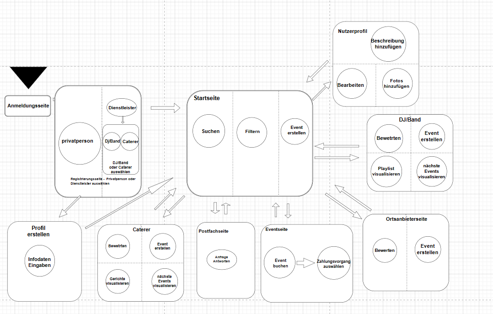
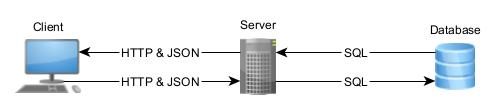

# Anforderungs- und Entwurfsspezifikation

# Eventure
von
* Marlon Cadell
* Luca Eberhardt
* Lucas Modesto
* Kirill Kuhn
* Angelo Mavridis

Link zur GitHub Organisation:
https://github.com/Softwareprojekt-Vierties

---

# Inhaltsverzeichnis
1. Einführung
2. Anforderungen
3. Technische Beschreibung
4. Projektorganisation
5. Anhänge

---

# 1 Einführung

In der heutigen Zeit ist die Organisation von Events oft fragmentiert und erfolgt über
verschiedene Kanäle wie Facebook, Twitter und WhatsApp. Diese Zersplitterung führt zu einer
unübersichtlichen Erfahrung für Veranstalter, Teilnehmer und Dienstleister. Mit Eventure
wollen wir diese Herausforderungen angehen und eine zentrale Plattform schaffen, die das
Erstellen, Verwalten und Erleben von Events revolutioniert.

Eventure ist eine innovative Plattform, die alle Aspekte der Eventorganisation in einem
integrierten Ökosystem vereint. Sie bietet eine umfassende Lösung für Eventbesucher, DJs,
Bands, Eventveranstalter und Catering-Unternehmen. Nutzer können auf Eventure öffentliche
und private Veranstaltungen entdecken, planen und daran teilnehmen. Die Plattform ermöglicht
es, alle notwendigen Ressourcen und Dienstleistungen an einem Ort zusammenzuführen, von
der Eventerstellung und Ticketverkauf bis hin zur Gästelistenverwaltung und Echtzeit-
Kommunikation.

Ein wesentlicher Bestandteil von Eventure ist der Marktplatz, auf dem Musiker, Caterer und
Locations ihre Dienste präsentieren und direkt von den Veranstaltern gebucht werden können.
Durch die Integration einer Chat-Funktion können Nutzer ihre Veranstaltungen leicht mit
Freunden teilen und planen. Die Plattform unterstützt auch das Erstellen von privaten Events
und fördert die Teilnahme an öffentlichen Veranstaltungen durch eine leistungsfähige Suche
und personalisierte Empfehlungen.

Eventure verfügt über einen interaktiven Veranstaltungskalender, der es den Nutzern
ermöglicht, ihre Pläne zu organisieren und keine bevorstehenden Events zu verpassen. Unser
Ziel ist es, die Art und Weise, wie Menschen Events planen und erleben, zu transformieren und
dabei jedem die Möglichkeit zu bieten, unvergessliche Erlebnisse zu schaffen und zu genießen.
Indem wir eine Plattform bieten, die nicht nur benutzerfreundlich, sondern auch vernetzt ist,
öffnen wir neue geschäftliche Möglichkeiten für Anbieter von Eventdienstleistungen und
schaffen eine lebendige Gemeinschaft von Eventliebhabern.

Eventure bringt Menschen und Möglichkeiten zusammen, um jeden Anlass besonders zu
machen. Wir streben danach, nicht nur die Veranstaltungssuche und -teilnahme zu vereinfachen,
sondern auch eine Gemeinschaft zu fördern, in der jeder Anlass zu einem einzigartigen Ereignis
wird.

---

# 2 Anforderungen
## 2.1 Stakeholder

| Funktion / Relevanz             | Name              | Kontakt / Verfügbarkeit    | Wissen                                    | Interessen / Ziele                                        |
|---------------------------------|-------------------|----------------------------|-------------------------------------------|-----------------------------------------------------------|
| Kunde / Konsument des Produktes | Endnutzer         | Unterwegs auf der Platform | -                                         | Events / Veranstaltungen finden und daran teilnehmen      |
| Kunde / Serviceanbieter         | DJs / Bands       | Verfügbar auf der Platform | Musikalisch                               | Publiz erhalten und Events zum auftreten finden           |
| Kunde / Serviceanbieter         | Caterer           | Verfügbar auf der Platform | kulinarische Dienstleistungen             | Aufträge generieren und Geschäft ausbauen                 |
| Kunde / Eventanbieter           | Eventplaner       | Verfügbar auf der Platform | Organisation                              | vereinfachte Eventplanung und leichte Organisation        |
| Kunde / Location Anbieter       | Location Anbieter | Verfügbar auf der Platform | -                                         | Räumlichkeiten präsentieren und Vermarktung               |
| Entwickler                      | Plattformanbieter | Verfügbar über GitHub      | Programmieren und Gestaltung der Platform | Platform und ihre Vorteile anbieten, Einkommen generieren |

---

## 2.2 Funktionale Anforderungen

* Use Case Diagram - Eventure


| Wer                                                   | Was                                                                            | Warum                                                                                                                                       | Titel                             |
|-------------------------------------------------------|--------------------------------------------------------------------------------|---------------------------------------------------------------------------------------------------------------------------------------------|-----------------------------------|
| Eventteilnehmer                                       | kann an Events teilnehmen                                                      | Weil der Eventteilnehmer an den Events teilnehmen möchte, solange diese öffentlich sind oder wenn er eine Einladung bekommen hat            | Eventteilnahme                    |
| Eventplaner                                           | kann sich die Profile der Caterer, Location Anbieter und DJs / Bands anschauen | Damit er sich besser über diese Dienstleister informieren kann                                                                              | Dienstleister Information         |
| Eventplaner                                           | kann Events erstellen                                                          | Damit er einen Event starten kann                                                                                                           | Event Erstellung                  |
| Eventplaner                                           | kann Dienstleister in einen Event eintragen                                    | Damit er angeben kann, welcher Dienstleister vorhanden ist                                                                                  | Dienstleister hinzufügen          |
| Dienstleister (Bands/DJs, Caterer, Location Anbieter) | kann bei Events als Dienstleister teilnehmen                                   | Damit diese ihre Dienstleistung anbieten und davon profitieren können, solange sie die Einladung als Dienstleister an dem Event akzeptieren | Dienstleistung-Akzeptur           |
| Dienstleister                                         | können einen Profil erstellen                                                  | Damit sie sich auf der Platform als Dienstleister bekannt machen                                                                            | Dienstleister Profil Erstellung   |
| Eventteilnehmer                                       | kann einen Profil erstellen                                                    | Damit er bei Events teilnehmen kann und die Daten an eine Person zugeordnet werden können                                                   | Eventteilnehmer Profil Erstellung |

---

### 2.2.1 Akteure

* Eventteilnehmer
  * nimmt an Events als Konsument teil
* Eventplaner
  * erstellt Events für Eventteilnehmer
    * kann Dienstleister zu diesem Event beantragen
* Dienstleister
  * sind Bands / DJs, Caterer und Location Anbieter
  * bieten ihre Dienstleistung an einen Event an
    * erhalten erst eine Einladung, um für einen Event ihre Dienste anzubieten
    * erst nachdem sie die Einladung akzeptiert haben, sind sie für eine Dienstleistung zuständig

* Akteure sowie andere Begriffe der implementierten Fachdomäne definieren
* Begriffe konsistent in der Spezifikation verwenden
* Begriffe im Glossar am Ende des Dokuments darstellen

---

## 2.3 Nicht-funktionale Anforderungen
### 2.3.1 Rahmenbedingungen
* Normen, Standards, Protokolle, Hardware, externe Vorgaben

* Standards
  * Einheitliches Webdesign
  * HTTPS
* Hardware
  * für Endnutzer
    * Gerät, dass auf das Web zugreifen kann
  * Server
    * muss Anfragen möglichst schnell verarbeiten (maximum 2ms)
    * muss möglichst schnelle Antworten liefern (maximum 2sek)
    * muss skalierbar sein, um für zukünftigen Wachstum zu kompensieren
    * muss sicher sein (https)
  * Datenbank
    * hohe Speicherkapazität für
      * Profilbilder
      * Hintergrundbilder von Profilen
      * Medienspeicher

---

### 2.3.2 Betriebsbedingungen
* Vorgaben des Kunden (z.B. Web Browser / Betriebssystem Versionen, Programmiersprache)
  
* Web Browser
  * Google Chrome
  * Microsoft Edge
  * Firefox
* Betriebssystem Versionen
  * nicht relevant, da Eventure eine Webanwendung ist
* Programmiersprache
  * Für Eventure werden Programmiersprachen bevorzugt, die eine Responsible Design für Webapplikationen anbieten. Javascript + Vue.vs

---

### 2.3.3 Qualitätsmerkmale
* Externe Qualitätsanforderungen (z.B. Performance, Sicherheit, Zuverlässigkeit,
  Benutzerfreundlichkeit)

  | Qualitätsmerkmal           | sehr gut | gut | normal | nicht relevant |
  |----------------------------|----------|-----|--------|----------------| 
  | **Zuverlässigkeit**        |          |     |        |                |
  | Fehlertoleranz             | X        | -   | -      | -              |
  | Wiederherstellbarkeit      | X        | -   | -      | -              |
  | Ordnungsmäßigkeit          | X        | -   | -      | -              |
  | Richtigkeit                | X        | -   | -      | -              |
  | Konformität                | -        | X   | -      | -              |
  | **Benutzerfreundlichkeit** |          |     |        |                |
  | Installierbarkeit          | -        | -   | -      | X              |
  | Verständlichkeit           | X        | -   | -      | -              |
  | Erlernbarkeit              | -        | X   | -      | -              |
  | Bedienbarkeit              | -        | X   | -      | -              |
  | **Performance**            |          |     |        |                |
  | Zeitverhalten              | -        | X   | -      | -              |
  | Effizienz                  | -        | X   | -      | -              |
  | **Sicherheit**             |          |     |        |                |
  | Analysierbarkeit           | X        | -   | -      | -              |
  | Modifizierbarkeit          | -        | -   | X      | -              |
  | Stabilität                 | X        | -   | -      | -              |
  | Prüfbarkeit                | X        | -   | -      | -              |

---

## 2.4 Graphische Benutzerschnittstelle


* [Desktop Website PDF](../GUI-Mockups/Eventure.pdf)
* [Desktop Website PowerPoint](../GUI-Mockups/Eventure.pptx)
* [Mobile Website PDF](../GUI-Mockups/EventureMobile.pdf)
* [Moblie Website PowerPoint](../GUI-Mockups/EventureMobile.pptx)


---

## 2.5 Anforderungen im Detail


### User Stories

| **Als**                                                | **möchte ich**                                                                 | **so dass**                                                                                   | **Titel**                                  | **Akzeptanz**                                                                                                                                   | **Prioridade** |
|--------------------------------------------------------|--------------------------------------------------------------------------------|-----------------------------------------------------------------------------------------------|--------------------------------------------|-------------------------------------------------------------------------------------------------------------------------------------------------|---------------|
| Eventteilnehmer                                        | kann an Events teilnehmen                                                      | Weil der Eventteilnehmer an den Events teilnehmen möchte                                      | Teilnahme an Events                        | akzeptiert, wenn Event öffentlich ist, genügend Tickets vorhanden sind oder eine Einladung für ein privates Event vorhanden ist                 | Hoch             |
| Eventplaner                                            | kann sich die Profile der Caterer, Location Anbieter und DJs / Bands anschauen | Damit er sich besser über diese Dienstleister informieren kann                                | Profilansicht der Dienstleister            | wenn der Eventplaner auf den Dienstleister-Profil klickt und wenn der Eventplaner ein Profil hat                                                | Hoch             |
| Eventplaner                                            | kann Events erstellen                                                          | Damit er einen Event starten kann                                                             | Erstellung von Events                      | wenn der Eventplaner ein Profil hat, mindestens eine Location angegeben ist und wenn alle Dienstleister die Eventeinladung akzeptiert haben     | Hoch             |
| Eventplaner                                            | kann Dienstleister in einen Event eintragen                                    | Damit er angeben kann, welcher Dienstleister vorhanden ist                                    | Eintrag von Dienstleistern in Events       | wenn der Eventplaner ein Profil hat                                                                                                           | Hoch             |
| Dienstleister (Bands/DJs, Caterer, Location Anbieter)  | kann bei Events als Dienstleister teilnehmen                                   | Damit diese ihre Dienstleistung anbieten und davon profitieren können                         | Teilnahme als Dienstleister bei Events     | wenn der Dienstleister ein Profil hat und eine Einladung zum Event als Dienstleister bekommen hat                                               | Hoch             |
| Dienstleister                                          | können einen Profil erstellen                                                  | Damit sie sich auf der Platform als Dienstleister bekannt machen                              | Profilerstellung für Dienstleister         | wenn der Dienstleister seine Identität als Dienstleister erwiesen hat                                                                           |     Hoch         |
| Eventteilnehmer                                        | kann einen Profil erstellen                                                    | Damit er bei Events teilnehmen kann und die Daten an eine Person zugeordnet werden können     | Profilerstellung für Eventteilnehmer       | wenn der Eventteilnehmer die AGBs akzeptiert hat                                                                                                | Hoch             |
| Benutzer   | mich registrieren und eine Konto anlegen       | ich die Services der Plattform nutzen kann| Registrierung und Kontoerstellung| wenn der Benutzer einen Benutzernamen und Passwort erstellt und die AGBs akzeptiert hat | Hoch            |
| Benutzer   | auf 'Weiter' klicken                            | ich meine Registrierung abschließen kann  | Abschluss der Registrierung      | wenn alle erforderlichen Informationen eingegeben wurden und validiert sind  | Hoch             |
| Neuer Nutzer| ein Konto erstellen, indem ich Benutzername, E-Mail und Passwort eingebe | ich Zugriff auf die Plattform und deren Dienste habe | Kontoerstellung auf Eventure | wenn der Benutzername einzigartig ist, das Passwort den Sicherheitsanforderungen entspricht und die E-Mail gültig ist | Hoch             |
| Registrierender Nutzer | zwischen einer Privatperson, Dienstleister-Konto wählen,DJ/Band und Caterer | ich das für meine Bedürfnisse passende Konto erstellen kann | Auswahl des Kontotyps  | wenn der Nutzer erfolgreich den gewünschten Kontotyp auswählt und das System diese Auswahl akzeptiert | Hoch             |
| Benuzter | nach Events, Benutzern, Veranstaltungsorten, Caterers, DJs und Bands suchen und sortieren | ich passende Optionen für meine Bedürfnisse finde oder anbieten kann            | Umfassende Suche          | wenn die Suchergebnisse alle relevanten Einträge basierend auf eingegebenen Suchkriterien präzise anzeigen | Hoch             |
| Benuzter | auf meine E-Mails  und mein Profil zugreifen | ich wichtige Kommunikationen verfolgen und meine persönlichen Informationen aktualisieren kann | Zugang auf E-Mails und Profil | wenn ich innerhalb der Plattform auf meine E-Mail-Nachrichten zugreifen und mein Profil einsehen und bearbeiten kann | Optional             |
| Dienstleister| Anfragen für Dienstleistungen in meiner Postfach-Übersicht annehmen oder ablehnen können | ich entscheiden kann, ob ich die angefragten Services für eine Veranstaltung bereitstellen möchte | Annahme oder Ablehnung von Dienstleistungsanfragen | wenn ich eine Anfrage über die Plattform erfolgreich annehmen oder ablehnen kann und dies in meinem Postfach reflektiert wird | Optional             |
| Benutzer | einen DJ über die Plattform buchen können     | ich die musikalische Unterhaltung für mein Event sichern kann | Buchung eines DJs            | wenn ich über die Plattform einen verfügbaren DJ auswählen und erfolgreich für ein bestimmtes Datum buchen kann | Hoch             |
| Benutzer | einen Caterer über die Plattform buchen können | ich hochwertige Speisen und Getränke für mein Event anbieten kann | Buchung eines Caterers       | wenn ich über die Plattform einen verfügbaren Caterer auswählen und erfolgreich für ein bestimmtes Datum buchen kann | Hoch             |
| Benutzer     | meine persönlichen Daten auf meinem Profil aktualisieren können | ich sicherstellen kann, dass meine Informationen stets aktuell und korrekt sind | Aktualisierung von Benutzerdaten | wenn ich meine Informationen wie Beschreibung, Fotos und persönliche Infos bearbeiten und speichern kann, und die Änderungen sofort sichtbar sind | Hoch             |
| Neuer Benutzer | mein Profil erstellen und meine Hauptdaten eingeben können | ich die Plattform nutzen und mich anderen Nutzern präsentieren kann | Erstellung eines Benutzerprofils | wenn ich ein Profil mit meinen Hauptdaten wie Name, Alter, Geschlecht, Region und Interessen erfolgreich erstellen und speichern kann | Hoch            |
| Location-Anbieter | mein Profil erstellen und Hauptdaten meines Veranstaltungsortes eingeben können | Veranstalter mich finden und meinen Ort für ihre Events buchen können | Erstellung eines Profils für Veranstaltungsorte | wenn ich ein Profil mit Informationen über die Kapazität, Verfügbarkeit, Standort und besondere Merkmale des Ortes erfolgreich erstellen und speichern kann | Hoch            |
| Benutzer | die Termine des Dienstleisters oder anderen Nutzer in einem Kalender ansehen | um meine Interaktionen und Dienstleistungen besser planen zu können, basierend auf seiner Verfügbarkeit oder Interessen | Anzeige der Termine und Interesse des Dienstleisters oder Nutzers | wenn  die Termine des Dienstleisters oder Nutzer in seinem Kalender angezeigt werden, um eine bessere Koordination zu ermöglichen | Optional |
| Benutzer | möchte ich optional Kommentare schreiben und Dienstleister mit Sternen bewerten können | um anderen Benutzern meine Erfahrungen mitzuteilen und Dienstleister entsprechend ihrer Leistung bewerten zu können | Bewertung und Kommentare für Dienstleister | wenn ich optional Kommentare zu Dienstleistern verfassen und sie mit Sternen bewerten kann, um meine Meinung zu teilen und anderen bei ihrer Entscheidung zu helfen | Optional |
|  Benutzer | möchte ich interaktiv mit einer Karte interagieren können, um Standorte zu visualisieren | um eine visuelle Darstellung der Standorte zu erhalten und geografische Distanzen besser zu verstehen | Interaktion mit einer Karte zur Anzeige von Standorten | wenn ich auf einer Karte interaktiv die Standorte anzeigen lassen kann, um eine bessere Orientierung und Verständnis der geografischen Verteilung zu erhalten | Hoch |
| Benutzer | möchte ich die Möglichkeit haben, Events mit einem Favoriten-Symbol zu markieren, um sie später leicht wiederfinden zu können | um meine bevorzugten Interessen zu speichern und später darauf zurückzugreifen | Markierung von Events als Favoriten | wenn ich Interessen mit einem Favoriten-Symbol markieren kann, um sie später schnell und einfach wiederzufinden | Hoch |
| Benutzer | möchte ich die Möglichkeit haben, Events basierend auf verschiedenen Filtern in verschiedenen Reihenfolgen anzuzeigen | um die Events entsprechend meinen Vorlieben und Bedürfnissen sortieren zu können | Anzeige von Events mit verschiedenen Filteroptionen | wenn ich die Events basierend auf Filtern wie Datum, Ort, Kategorie usw. in verschiedenen Reihenfolgen anzeigen lassen kann, um die für mich relevanten Events leicht zu finden | Hoch |




---

# 3 Technische Beschreibung
## 3.1 Systemübersicht

* Systemarchitekturdiagramm ("Box-And-Arrow" Diagramm)
* Kommunikationsprotokolle, Datenformate
  Das Diagramm in Kapitel "Systemübersicht" ist statisch und nicht dynamisch und stellt
  daher keine Abläufe dar. Abläufe werden im Kapitel "Abläufe" dargestellt. Im Kapitel
  "Systemübersicht" soll genau ein Diagramm dargstellt werden. Das "Box-and-Arrow"-Diagramm
  soll als Systemarchitekturdiagramm eine abstrakte Übersicht über das Softwaresystem
  geben. Dazu stellt es die Rechnerknoten und deren Kommunikationsbeziehungen (Protokoll
  (z.B. HTTP), Datenformat (z.B. JSON)) dar. Also Rechtecke und gerichtete Pfeile. Ähnlich
  einem UML-Deployment-Diagramm, aber noch abstrakter, denn es zeigt nicht die Verteilung
  der Softwarebausteine auf die Rechnerknoten. So erlangt der Leser einen schnellen und
  guten Überblick über das Softwaresystem.

---

## 3.2 Softwarearchitektur
* Darstellung von Softwarebausteinen (Module, Schichten, Komponenten)
  Hier stellen Sie die Verteilung der Softwarebausteine auf die Rechnerknoten dar. Das ist
  die Softwarearchitektur. Zum Beispiel Javascript-Software auf dem Client und Java-
  Software auf dem Server. In der Regel wird die Software dabei sowohl auf dem Client als
  auch auf dem Server in Schichten dargestellt.
* Server
* Web-Schicht
* Logik-Schicht
* Persistenz-Schicht
* Client
* View-Schicht
* Logik-Schicht
* Kommunikation-Schicht
  Die Abhängigkeit ist bei diesen Schichten immer unidirektional von "oben" nach "unten".
  Die Softwarearchitektur aus Kapitel "Softwarearchitektur" ist demnach detaillierter als
  die Systemübersicht aus dem Kapitel "Systemübersicht". Die Schichten können entweder als
  Ganzes als ein Softwarebaustein angesehen werden. In der Regel werden die Schichten aber
  noch weiter detailliert und in Softwarebausteine aufgeteilt.

* Architektur


* ER-Diagram


* Kommunikation zwischen Client und Server


### Server

* Webschicht
* Logik-Schicht
  * in Java geschrieben
* Persistenz-Schicht

### Client

* View-Schicht
* Logik-Schicht
* Kommunikation-Schicht
  * HTTP(s), Web Token, JSON

---

### 3.2.1 Technologieauswahl
### Framework
* **vue.js**
### Technologien
* **MySQL**
### Datenformate
* **JSON**
* **Web Token**
### Protokolle
* **HTTP**

Beschreiben Sie hier, welche Frameworks / Technologien / Bibliotheken / Datenformate /
Protokolle benutzt werden.

---

## 3.3 Schnittstellen
### Schnittstellenbeschreibung (API)
* Auflistung der nach außen sichtbaren Schnittstelle der Softwarebausteine
  Hier sollen sämtliche Schnittstellen definiert werden:
* die externen Schnittstellen nach außen. Über welche Schnittstelle kann z.B. der Client
  den Server erreichen?
* die internen Schnittstellen der unter 3.2 definierten Softwarebausteine
  Es ist sinnvoll, wenn die API von denjenigen definiert werden, die die Anforderungen an
  die API kennen: in einem Client-Server-System haben die Client-Entwickler Anforderungen
  an die Backend-Entwickler, sodass in diesem Fall die Client-Entwickler die API
  definieren sollten, die dann vom Backend-Entwickler implementiert werden.

### REST.api (RESTful API)
* erleichtert Interaktion zwischen Client und Server
* Daten und Funktionalitäten werden als Ressourcen dargestellt
  * können Bilder oder andere Dateien sein
* bietet standardisierte HTTP-Methoden an
  * **GET** (Abrufen von Daten)
  * **POST** (Erstellen von neuen Daten)
  * **PUT** (Aktualisieren von Daten)
  * **DELETE** (Löschen von Daten)
* HATEOAS
  * steht für: Hypermedia als Motor der Anwendungszustand
  * Server sendet mit jeder Antwort an den Client auch Links
  * Links liefern andere relevante Ressourcen

### Request Message Beispiel POST
```http request
POST /dinosaur HTTP/1.1

// Headers
Accept: application/json
Authorization: <token>
Connection: keep-alive
Content-Type: application/json
Content-Length: <length of body in bytes>

// Body
{
 "face": "T-Rex",
 "color": "brown"
}
```

### Response Message Beispiel
```
HTTP/1.1 200 OK

// Headers
Server: nginx
Age: 2323
Connection: keep-alive
Content-Type: application/json

// Body
{
 "id": "123",
 "status": "success"
}
```

### Code Example:

```javascript
const express = require('express'); // Express.js-Framework für Node.js
const bodyParser = require('body-parser'); // um die JSON-Daten aus den Anfragen zu parsen

const app = express(); 
const port = 3000; 

// Beispiel-Daten
let books = [
    { id: 1, title: 'Python Programming', author: 'John Smith' },
    { id: 2, title: 'Data Science Handbook', author: 'Jane Doe' }
];

app.use(bodyParser.json()); // verwendet den bodyParser als Middleware

// GET-Methode, um alle Bücher abzurufen
app.get('/books', (req, res) => {
    res.json(books);
});

// POST-Methode, um ein neues Buch hinzuzufügen
app.post('/books', (req, res) => {
    const newBook = req.body;
    books.push(newBook);
    res.status(201).json(
        { message: 'Book added successfully', book: newBook }
    );
});

// PUT-Methode, um ein vorhandenes Buch zu aktualisieren
app.put('/books/:id', (req, res) => {
    const bookId = parseInt(req.params.id);
    const updatedBook = req.body;

    books = books.map(book => {
        if (book.id === bookId) {
            return { ...book, ...updatedBook };
        }
        return book;
    });

    res.json(
        { message: 'Book updated successfully', book: updatedBook }
    );
});

// DELETE-Methode, um ein Buch zu löschen
app.delete('/books/:id', (req, res) => {
    const bookId = parseInt(req.params.id);

    books = books.filter(book => book.id !== bookId);

    res.json(
        { message: 'Book deleted successfully' }
    );
});

// Startet den Server
app.listen(port, () => {
    console.log(`Server is listening at http://localhost:${port}`);
});
```

req = request <br>
res = response


| Erzeuger | HTTP |Request JSON/path| Respons JSON|
  |----------|-----------|----------|-----------|
  | Login | POST /login |username(string),<br>keyword(string)|status(int),<br>uuid(int)|
  |Register|POST /register|username(string),<br>keyword(string),<br>email(string)|status(int),<br>uuid(int)|
  |Startseite suchen|POST /search|eventSizeMin(int),<br>eventSizeMax(int),<br>ticketpriceMin(int),<br>ticketpriceMax(int),<br>distance(int),<br>ageMin(int),<br>ageMax(int),<br>dateMin(string),<br>dateMax(string),<br>TimeMin(int),<br>TimeMax(int),<br>durationMin(int),<br>durationMax(int),<br>OpenAir(bool)|events(event[])
  |Postfach|GET /postfach/search|?i=<>&s=<>|emails(email[])|
  |Postfach|POST /postfach/accept|accept(bool),<br>emailId(int)|-|
  |Locaiton Profile|GET /location|?i=<>|name(stirng),<br>picture(?),<br>shortDescription(string),<br>capacity(int),<br>description(string),<br>city(string),<br>address(string),<br>price(int),<br>size(int),<br>openAir(bool),<br>reviews(review[]),<br>dates(string[]){date(string)}|
  |Services|GET /service|?i=<>|description(string),<br>shortDescription(string),<br>events(event[]),<br>playlist(song[]),<br>experience(int), <br>price(float), <br>reviews(review[]),<br>shortDescription(string), <br>name(string),<br> picture(?),<br>city(string), <br>category(string)|
  |Event|GET /event|?i=<>|name(stirng),<br>picture(?),<br>shortDescription(string),<br>description(string),<br>price(int),<br>size(int),<br>timeStart(int),<br>timeEnd(int),<br>ageRestriction(int),<br>eventSize(int),<br>openAir(bool),<br>dates(string[]){date(string)},<br>services(services[]){id(int),name(string),picture(?)}|
  |Location erstellen|POST /location|name(stirng),<br>picture(?),<br>description(string),<br>shortDescription(string),<br>city(string),<br>address(string),<br>price(int),<br>size(int),<br>openAir(bool),<br>capacity(int)|-|
  |Service erstellen|POST /service|description(string),<br>shortDescription(string),<br>events(event[]),<br>playlist(song[]),<br>experience(int),<br>price(float),<br>shortDescription(string),<br>name(string), <br>picture(?),<br>city(string),<br>category(string)|-|
  |Event erstellen|POST(Service)|name(stirng),<br>picture(?),<br>shortDescription(string),<br>description(string),<br>price(int),<br>size(int),<br>timeStart(int),<br>timeEnd(int),<br>ageRestriction(int),<br>eventSize(int),<br>openAir(bool),<br>dates(string[]){date(string)},<br>services(services[]){id(int),name(string),picture(?)}|-|

einzelne Arrays erklärt:

review: {
	id(int),
writer(sting),
stars(int),
text(string)
}

event: {
	namen(string),
location(string),
date(string),
zeitStart(int),
zeitEnde(int),
id(int)
} 

email: {
sender(string),
topic(string),
text(string)
id(int)
}

song: {
name(string),
id(int),
length(time?),
year(int)
}

dish: {
	name(string),
	id(int),
	ingredient1(string),
	ingredient2(string)
}

---

## 3.4 Datenmodell
### ER-Modell der Datenbank


* Konzeptionelles Analyseklassendiagramm (logische Darstellung der Konzepte der
  Anwendungsdomäne)
* Modellierung des physikalischen Datenmodells
* RDBMS: ER-Diagramm bzw. Dokumentenorientiert: JSON-Schema

---

## 3.5 Abläufe
### Ablauf Diagramme
* Location Erstellen:


* Event Teilnahme:


* Event Planung:


* Bänd anlegen:


* Catering anlegen:


### Client-Server Kommunikation


* Aktivitätsdiagramme für relevante Use Cases
* Aktivitätsdiagramm für den Ablauf sämtlicher Use Cases
* Aktivitätsdiagramm mit Swimlanes sind in der Regel hilfreich
  für die Darstellung der Interaktion von Akteuren der Use Cases / User Stories
* Abläufe der Kommunikation von Rechnerknoten (z.B. Client/Server)
  in einem Sequenz- oder Aktivitätsdiagramm darstellen
* Modellieren Sie des weiteren die Diagramme, die für das (eigene) Verständnis des
  Softwaresystems hilfreich sind.

---

## 3.7 Fehlerbehandlung
* Mögliche Fehler / Exceptions auflisten
* Fehlercodes / IDs sind hilfreich
* Nicht nur Fehler technischer Art ("Datenbankserver nicht erreichbar") definieren,
  sondern auch im Hinblick auf
  Kapitel 3.8 sind fachliche Fehler wie "Kunde nicht gefunden". "Nachricht wurde bereits
  gelöscht" o.ä.

### Mögliche Fehler / Exceptions

* 400 Bad Request
  * Fehlerhafte Syntax in den Protokollen
* 403 Forbidden
  * Eventteilnehmer versucht privaten Event aufzurufen, auf den er keinen Zugriff hat
* 404 Not Found
  * Fehlende Events, Dienstleister- / Eventteilnehmer Profile
* 500 Internal Server Error
  * Syntax oder Fehler im Code Serverseitig
* 503 Service Unavailable
  * Datenbank vom Server nicht erreichbar

* Zahlung nicht möglich
  * Ticket für ein Event konnte nicht bezahlt werden
  * Dienstleister konnten nicht angeworben werden
  * Fehlerhafte Angaben in der Zahlungsmethode
  * Konto gesperrt / nicht genügend Geld

---

## 3.8 Validierung
* Relevante (Integrations)-Testfälle, die aus den Use Cases abgeleitet werden können
* Testfälle für
  * Datenmodell
  * API
  * User Interface
* Fokussieren Sie mehr auf Integrationstestfälle als auf Unittests
* Es bietet sich an, die IDs der Use Cases / User Stories mit den Testfällen zu
  verbinden, sodass erkennbar ist, ob Sie alle Use Cases getestet haben.

---

# 4 Projektorganisation
## 4.1 Annahmen

### Framework 
#### Webentwicklung
* **vue.js** 5.0.8
### verwendete Programmiersprachen
#### Server
* **JavaScript**
#### Webentwicklung
##### Frontend
* **HTML5**
* **CSS**
* **JavaScript**
##### Backend
* **JavaScript**
#### Datenbank
* **SQL**

* Nicht durch den Kunden definierte spezifische Annahmen, Anforderungen und
  Abhängigkeiten
* Verwendete Technologien (Programmiersprache, Frameworks, etc.)
* Aufteilung in Repositories gemäß Software- und Systemarchitektur und Softwarebausteinen
* Einschränkungen, Betriebsbedingungen und Faktoren, die die Entwicklung beeinflussen
  (Betriebssysteme, Entwicklungsumgebung)
* Interne Qualitätsanforderungen (z.B. Softwarequalitätsmerkmale wie z.B.
  Erweiterbarkeit)

---

## 4.2 Verantwortlichkeiten
* Zuordnung von Personen zu Softwarebausteinen aus Kapitel "Systemübersicht" und
  "Softwarearchitektur"
* Rollendefinition und Zuordnung
  | Softwarebaustein | Person(en) |
  |----------|-----------|
  | Komponente A | Thomas Mustermann |

---

### Rollen
Überlegen Sie, ob es sinnvoll ist, wenn Sie die Rollen für
Product-Owner und Scrum-Master vergeben, wobei Sie bedenken
sollten, ob diese Rollen über den gesamten Projektzeitraum
aktiv sein werden. Neben diesen Rollen können folgende Rollen
sinnvoll sein:

---

#### Softwarearchitekt
Entwirft den Aufbau von Softwaresystemen und trifft Entscheidungen über das Zusammenspiel
der Softwarebausteine.

---

#### Frontend-Entwickler
Entwickelt graphische oder andere Benutzerschnittstellen, insbesondere das Layout einer
Anwendung.

---

#### Backend-Entwickler
Implementiert die funktionale Logik der Anwendung. Hierbei werden zudem diverse
Datenquellen und externe Dienste integriert und für die Anwendung bereitgestellt.

---

#### DevOps-Engineer
Ist für die Repositories und das Deployment verantwortlich.

---

### Rollenzuordnung
| Name              | Rolle               |
|-------------------|---------------------|
| Luca Eberhardt    | Frontend-Entwickler  |
| Angelo Mavridis   | Backend-Entwickler   |
| Marlon Cadell     | Frontend-Entwickler und DevOps-Engineer |
| Lucas Modesto     | Frontend-Entwickler |
| Kirill Kuhn       | Backend-Entwickler  |

Backend:
* Datenbank
* Server

Frontend:
* HTML Webseite
* CSS

---

## 4.3 Grober Projektplan
- Webseite fertigstellen
- Eventteilnehmer Profile erstellbar
- Event Suche und Teilnahme realisieren
- Dienstleister Profile erstellbar
- Event erstellen können
- Implementierung von Akzeptur der Dienstleister 
- Ticket-System realisieren

### Zusätzliche:
- Bewertungen von Dienstleister
- DJs / Bands können Playlisten auf ihren Profilen angeben
- Caterer können Menüs präsentieren
- Blogs/Chats realisieren
- Events nach Kriterien filtern
- Event Empfehlungen

---

### Deadlines
* 23.05 MVP (Datenbank, Server, Webseite)
* 04.06 LATEST DATE für MVP
* KW 27/28 Präsentation des gesamten Projektes

---

# 5 Anhänge
## 5.1 Glossar
* Definitionen, Abkürzungen, Begriffe

### Akteure
* Eventteilnehmer
  * nimmt an Events als Konsument teil
* Eventplaner
  * erstellt Events für Eventteilnehmer
    * kann Dienstleister zu diesem Event beantragen
* Dienstleister
  * sind Bands / DJs, Caterer und Location Anbieter
  * bieten ihre Dienstleistung an einen Event an
    * erhalten erst eine Einladung, um für einen Event ihre Dienste anzubieten
    * erst nachdem sie die Einladung akzeptiert haben, sind sie für eine Dienstleistung zuständig

## 5.2 Referenzen
* Handbücher, Gesetze
* z.B. Datenschutzgrundverordnung

## 5.3 Index
