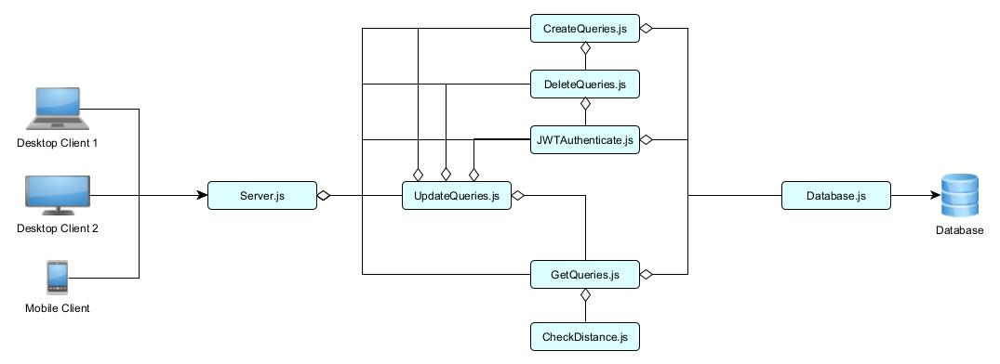
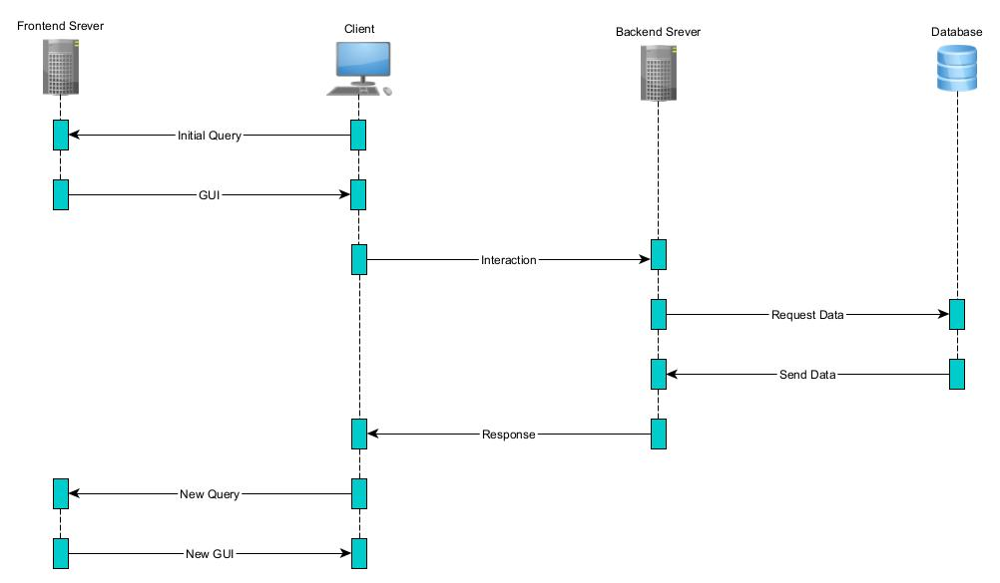

# Anforderung- und Entwurfsspezifikation

# Eventure
von
* Marlon Cadell
* Luca Eberhardt
* Lucas Modesto
* Kirill Kuhn
* Angelo Mavridis

Link zur GitHub Organisation:
https://github.com/Softwareprojekt-Vierties

---

# Inhaltsverzeichnis
1. Einführung
2. Anforderungen
3. Technische Beschreibung
4. Projektorganisation
5. Anhänge

---

# 1 Einführung

In der heutigen Zeit ist die Organisation von Events oft fragmentiert und erfolgt über
verschiedene Kanäle wie Facebook, Twitter und WhatsApp. Diese Zersplitterung führt zu einer
unübersichtlichen Erfahrung für Veranstalter, Teilnehmer und Dienstleister. Mit Eventure
wollen wir diese Herausforderungen angehen und eine zentrale Plattform schaffen, die das
Erstellen, Verwalten und Erleben von Events revolutioniert.

Eventure ist eine innovative Plattform, die alle Aspekte der Eventorganisation in einem
integrierten Ökosystem vereint. Sie bietet eine umfassende Lösung für Eventbesucher, DJs,
Bands, Eventveranstalter und Catering-Unternehmen. Nutzer können auf Eventure öffentliche
und private Veranstaltungen entdecken, planen und daran teilnehmen. Die Plattform ermöglicht
es, alle notwendigen Ressourcen und Dienstleistungen an einem Ort zusammenzuführen, von
der Eventerstellung und Ticketverkauf bis hin zur Gästelistenverwaltung und Echtzeit-
Kommunikation.

Ein wesentlicher Bestandteil von Eventure ist der Marktplatz, auf dem Musiker, Caterer und
Locations ihre Dienste präsentieren und direkt von den Veranstaltern gebucht werden können.
Durch die Integration einer Email-Funktion können Nutzer ihre Veranstaltungen leicht mit
Freunden teilen und planen. Die Plattform unterstützt auch das Erstellen von privaten Events
und fördert die Teilnahme an öffentlichen Veranstaltungen durch eine leistungsfähige Suche..

Unser Ziel ist es, die Art und Weise, wie Menschen Events planen und erleben, zu transformieren und
dabei jedem die Möglichkeit zu bieten, unvergessliche Erlebnisse zu schaffen und zu genießen.
Indem wir eine Plattform bieten, die nicht nur benutzerfreundlich, sondern auch vernetzt ist,
öffnen wir neue geschäftliche Möglichkeiten für Anbieter von Eventdienstleistungen und
schaffen eine lebendige Gemeinschaft von Eventliebhabern.

Eventure bringt Menschen und Möglichkeiten zusammen, um jeden Anlass besonders zu
machen. Wir streben danach, nicht nur die Veranstaltungssuche und -teilnahme zu vereinfachen,
sondern auch eine Gemeinschaft zu fördern, in der jeder Anlass zu einem einzigartigen Ereignis
wird.

---

# 2 Anforderungen
## 2.1 Stakeholder

| Funktion / Relevanz             | Name                | Kontakt / Verfügbarkeit     | Wissen                                    | Interessen / Ziele                                        |
|---------------------------------|---------------------|-----------------------------|-------------------------------------------|-----------------------------------------------------------|
| Kunde / Konsument des Produktes | Endnutzer           | Die Endnutzer sind jederzeit und überall über die Plattform erreichbar, da sie sich über ihre persönlichen Geräte wie Smartphones, Tablets und Computer einloggen können. | Endnutzer haben allgemeine Kenntnisse in der Nutzung von Event-Plattformen und verstehen, wie sie Veranstaltungen finden und daran teilnehmen können. Sie sind mit digitalen Medien vertraut und nutzen diese regelmäßig, um soziale und Freizeitaktivitäten zu planen. | Die Endnutzer möchten leicht und schnell interessante Events und Veranstaltungen finden, daran teilnehmen und ihre sozialen Erlebnisse verbessern. Sie suchen eine benutzerfreundliche Plattform, die ihnen alle relevanten Informationen und Dienste in einem übersichtlichen Format bietet, sowie Möglichkeiten zur Interaktion mit anderen Teilnehmern und Veranstaltern. |
| Kunde / Serviceanbieter         | DJs / Bands         | DJs und Bands sind jederzeit über die Plattform verfügbar, um ihre Dienste anzubieten. Sie können ihre Profile aktualisieren, Auftritte planen und mit Veranstaltern in Kontakt treten. | DJs und Bands verfügen über umfangreiche musikalische Kenntnisse und Erfahrung im Unterhaltungsbereich. Sie verstehen, wie sie ihre Dienste präsentieren und ihre Zielgruppen ansprechen können. Zudem haben sie Erfahrung in der Live-Performance und wissen, welche technischen Anforderungen und organisatorischen Details für erfolgreiche Auftritte wichtig sind. | DJs und Bands wollen ihre Reichweite erhöhen, neue Auftrittsmöglichkeiten finden und ihr Publikum erweitern. Sie suchen eine Plattform, die ihnen hilft, ihre Musik und Dienstleistungen zu bewerben und direkt mit Veranstaltern in Kontakt zu treten. Sie möchten zudem Feedback von ihrem Publikum erhalten und ihre Präsenz in der Eventszene stärken. |
| Kunde / Serviceanbieter         | Caterer             | Caterer sind über die Plattform verfügbar, um ihre kulinarischen Dienstleistungen anzubieten. Sie können ihre Menüs präsentieren, Buchungen verwalten und direkt mit Veranstaltern kommunizieren. | Caterer haben umfassende Kenntnisse in der Bereitstellung kulinarischer Dienstleistungen, einschließlich Planung, Zubereitung und Präsentation von Speisen für Events. Sie kennen die unterschiedlichen kulinarischen Bedürfnisse und Vorlieben der Kunden und können maßgeschneiderte Angebote erstellen. Zudem haben sie Erfahrung im Management von Catering-Teams und der Logistik rund um die Essenslieferung. | Caterer sind daran interessiert, neue Aufträge zu generieren und ihr Geschäft auszubauen. Sie suchen eine Plattform, die ihnen hilft, ihre kulinarischen Angebote zu präsentieren, Kunden zu gewinnen und ihre Dienstleistungen effizient zu verwalten. Sie möchten ihre Reichweite erhöhen und langfristige Beziehungen zu Eventplanern und anderen Kunden aufbauen. |
| Kunde / Eventanbieter           | Eventplaner         | Eventplaner sind über die Plattform verfügbar, um ihre Events zu erstellen, zu verwalten und zu promoten. Sie können auf Ressourcen und Dienstleister zugreifen. | Eventplaner besitzen umfangreiche Kenntnisse in der Planung und Organisation von Veranstaltungen, einschließlich Logistik, Zeitmanagement und Koordination verschiedener Dienstleister. Sie verstehen die Bedürfnisse ihrer Zielgruppen und können maßgeschneiderte Eventkonzepte entwickeln. Zudem haben sie Erfahrung im Krisenmanagement und wissen, wie sie auf unerwartete Situationen reagieren müssen. | Eventplaner möchten den Planungsprozess vereinfachen, die Organisation ihrer Events optimieren und Zugang zu einer breiten Palette von Dienstleistern und Ressourcen erhalten. Sie suchen nach einer zentralen Plattform, die ihnen bei der effizienten Verwaltung aller Aspekte ihrer Veranstaltungen hilft. Ihr Ziel ist es, unvergessliche Erlebnisse für ihre Teilnehmer zu schaffen und ihre Events erfolgreich durchzuführen. |
| Kunde / Location Anbieter       | Location Anbieter   | Location Anbieter sind über die Plattform verfügbar, um ihre Räumlichkeiten anzubieten. Sie können detaillierte Beschreibungen und Bilder ihrer Locations hochladen und Buchungsanfragen verwalten. | Location Anbieter kennen sich gut mit der Vermietung und Verwaltung von Veranstaltungsräumen aus. Sie verstehen die Anforderungen und Bedürfnisse verschiedener Eventtypen und wie sie ihre Räumlichkeiten entsprechend vermarkten können. Sie haben Erfahrung im Facility Management und wissen, welche technischen und logistischen Aspekte für die Durchführung von Events wichtig sind. | Location Anbieter wollen ihre Räumlichkeiten effektiv präsentieren und vermarkten, um eine hohe Auslastung zu erreichen und ihre Einnahmen zu maximieren. Sie suchen eine Plattform, die ihnen hilft, ihre Angebote sichtbar zu machen und Buchungen zu erleichtern. Ihr Ziel ist es, langfristige Partnerschaften mit Eventplanern und anderen Dienstleistern aufzubauen und ihre Locations als erstklassige Veranstaltungsorte zu etablieren. |
| Entwickler / Betreiber          | Plattformanbieter   | Plattformanbieter sind über GitHub und andere Entwickler-Communities verfügbar. Sie kommunizieren über diese Plattformen und können ihre Arbeit durch regelmäßige Updates und Feedback-Schleifen koordinieren. | Plattformanbieter haben Kenntnisse in der Programmierung. Sie verstehen die technischen und funktionalen Anforderungen, um eine benutzerfreundliche und leistungsfähige Plattform zu schaffen. | Die Plattformanbieter möchten eine robuste und vielseitige Plattform entwickeln, die sowohl für Nutzer als auch für Dienstleister attraktiv ist. Ihr Ziel ist es, eine innovative Lösung zu bieten, die die Eventorganisation revolutioniert, und gleichzeitig Einnahmen durch die Bereitstellung der Plattform zu generieren. Sie streben danach, die Benutzererfahrung kontinuierlich zu verbessern und die Plattform an die sich ändernden Bedürfnisse des Marktes anzupassen. |

Diese detaillierte Stakeholder-Analyse bietet einen umfassenden Überblick über die verschiedenen Interessengruppen von Eventure, ihre spezifischen Kenntnisse, Interessen und Ziele. Sie ist entscheidend für die erfolgreiche Entwicklung und den Betrieb der Plattform, da sie dabei hilft, die Bedürfnisse und Erwartungen aller Beteiligten zu verstehen und zu erfüllen.

---

## 2.2 Funktionale Anforderungen

* Use Case Diagram - Eventure


## 2.2 Funktionale Anforderungen

| Wer                                                   | Was                                                                            | Warum                                                                                                                                       | Titel                             |
|-------------------------------------------------------|--------------------------------------------------------------------------------|---------------------------------------------------------------------------------------------------------------------------------------------|-----------------------------------|
| Eventteilnehmer                                       | Eventteilnehmer können an Events teilnehmen, die auf der Plattform verfügbar sind. Dies umfasst sowohl öffentliche Events, die für alle sichtbar sind, als auch private Events, zu denen sie eine Info erhalten haben. Sie können sich für Events registrieren, Tickets kaufen und detaillierte Informationen über die Veranstaltung einsehen, wie z.B. Veranstaltungsort, Zeitplan, und spezielle Anweisungen des Veranstalters. Zudem erhalten sie Benachrichtigungen über die Eventinfos und zusätzliche Informationen, die für die Teilnehmer relevant sind. | Eventteilnehmer möchten an verschiedenen Events teilnehmen, um ihre sozialen Aktivitäten zu bereichern, neue Erfahrungen zu sammeln und sich mit Freunden und der Community zu vernetzen. Die Möglichkeit, einfach und schnell an Events teilzunehmen, ist ein zentraler Anreiz für die Nutzung der Plattform. Außerdem möchten sie eine einfache Möglichkeit haben, ihre Tickets zu verwalten, Erinnerungen zu erhalten und über Eventänderungen informiert zu werden. Dies erhöht ihre Zufriedenheit und Bindung an die Plattform. | Eventteilnahme                    |
| Eventteilnehmer                                       | Eventteilnehmer können ein persönliches Profil auf der Plattform erstellen, um ihre Teilnahme an Events zu verwalten und ihre Präferenzen zu speichern. In diesem Profil können sie ihre persönlichen Informationen, wie Name, Informationen, Partybilder und Interessen, angeben. Sie können auch zukünftige Events, an denen sie teilnehmen werden, einsehen und verwalten. Das Profil ermöglicht es den Teilnehmern, sich mit anderen Nutzern zu vernetzen, Freunde einzuladen und ihre sozialen Netzwerke zu erweitern. | Ein persönliches Profil ermöglicht es Eventteilnehmern, ihre Aktivitäten auf der Plattform zu verfolgen, Einladungen zu erhalten und an Events teilzunehmen. Es hilft auch dabei, die Benutzererfahrung zu personalisieren und relevante Events und Dienstleistungen vorzuschlagen. Teilnehmer können ihre Präferenzen angeben, um maßgeschneiderte Kontakte im sozialen Netzwerk zu knüpfen. Durch die Verwaltung ihrer Teilnahme und den Erhalt von Emails bleiben sie besser organisiert und können ihre Freizeit effizienter planen. | Eventteilnehmer Profil Erstellung |
| Eventplaner                                           | Eventplaner können sich detaillierte Profile der Caterer, Location Anbieter und DJs / Bands auf der Plattform anschauen. Diese Profile enthalten umfassende Informationen über die angebotenen Dienstleistungen, Preise, Bewertungen durch andere Eventplaner und die Verfügbarkeit der Dienstleister. Eventplaner können auch Fotos, Videos und Beispielarbeiten der Dienstleister einsehen, um sich ein besseres Bild von deren Fähigkeiten und Angeboten zu machen. Sie können direkt über die Plattform Anfragen stellen, Verfügbarkeiten prüfen und Buchungen vornehmen. | Eventplaner müssen sich umfassend über die verfügbaren Dienstleister informieren, um die besten Entscheidungen für ihre Veranstaltungen zu treffen. Detaillierte Profile helfen ihnen, die Qualität und Eignung der Dienstleister zu beurteilen und passende Partner für ihre Events zu finden. Darüberhinaus, können Eventplaner sich über die Kommentarfunktion ein besseres Bild von der Qualität der Diestleister machen. Dies erleichtert den Planungsprozess und trägt zur erfolgreichen Durchführung der Veranstaltung bei. Durch die Möglichkeit, direkt über die Plattform Anfragen zu stellen und Buchungen vorzunehmen, wird der gesamte Planungsprozess effizienter und transparenter. | Dienstleister Information         |
| Eventplaner                                           | Eventplaner können neue Events auf der Plattform erstellen. Dies umfasst das Festlegen von Datum, Uhrzeit, Ort, Art der Veranstaltung, Zielgruppe und anderen relevanten Details. Sie können auch entscheiden, ob das Event öffentlich oder privat ist und wer buchen darf wird. Zusätzlich können Eventplaner spezielle Anforderungen und Anweisungen für die Teilnehmer festlegen, z.B. Dresscodes, Eintrittsbedingungen oder besondere Hygienemaßnahmen. | Die Möglichkeit, eigene Events zu erstellen, ist essenziell für Eventplaner, um ihre beruflichen und persönlichen Veranstaltungen zu organisieren und zu verwalten. Dies ermöglicht ihnen, alle Aspekte des Events von einem zentralen Punkt aus zu koordinieren und sicherzustellen, dass alle Details rechtzeitig kommuniziert werden. Durch das Versenden von Einladungen wird der Planungsprozess weiter vereinfacht. Spezielle Anforderungen und Anweisungen helfen, das Event reibungslos und nach den Vorstellungen des Planers ablaufen zu lassen. | Event Erstellung                  |
| Eventplaner                                           | Eventplaner können verschiedene Dienstleister (wie Caterer, Location Anbieter und DJs / Bands) in ihre Events eintragen und deren Dienstleistungen buchen. Sie können die Verfügbarkeit der Dienstleister prüfen, Angebote vergleichen und Buchungen vornehmen. Eventplaner können auch Verträge abschließen und Zahlungen über die Plattform abwickeln. Zudem haben sie direkte Kommunikationskanäle zu Dienstleistern für Absprachen und Koordination. Eventplaner können Feedback von Dienstleistern einholen und umgekehrt, um sicherzustellen, dass alle Anforderungen und Erwartungen klar kommuniziert werden. | Indem Eventplaner Dienstleister zu ihren Events hinzufügen, können sie sicherstellen, dass alle notwendigen Ressourcen und Services vorhanden sind. Dies erleichtert die Planung und Organisation, da alle relevanten Informationen an einem Ort gesammelt werden. Es ermöglicht auch eine effizientere Kommunikation und Koordination zwischen den Eventplanern und den Dienstleistern. Durch die Möglichkeit, Zahlungen abzuwickeln, wird der gesamte Prozess transparenter und sicherer. Feedbackmechanismen tragen dazu bei, die Qualität der Zusammenarbeit zu verbessern und zukünftige Events besser zu planen. | Dienstleister hinzufügen          |
| Dienstleister (Bands/DJs, Caterer, Location Anbieter) | Dienstleister können an Events als gebuchte Dienstleister teilnehmen und ihre Dienstleistungen vor Ort anbieten. Dies geschieht, wenn sie vom Eventplaner eingeladen wurden und die Einladung akzeptieren. Dienstleister können ihre Verfügbarkeit auf der Plattform verwalten, Buchungsanfragen beantworten und ihre Dienstleistungen entsprechend vorbereiten. Sie können auch spezielle Anforderungen und Wünsche der Eventplaner berücksichtigen, um ihre Dienstleistungen optimal anzupassen. Zudem haben sie die Möglichkeit, nach dem Event Feedback zu erhalten und Bewertungen zu sammeln, um ihre Dienstleistungen kontinuierlich zu verbessern. | Dienstleister profitieren davon, wenn sie ihre Dienste bei Events anbieten können, da sie so ihre Reichweite und ihren Kundenstamm erweitern. Die Möglichkeit, direkt über die Plattform gebucht zu werden, vereinfacht den Geschäftsprozess und erhöht ihre Sichtbarkeit. Sie können auch Feedback von Eventplanern und Teilnehmern erhalten, was zur Verbesserung ihrer Dienstleistungen beiträgt. Durch die Verwaltung ihrer Verfügbarkeit und die direkte Kommunikation mit den Eventplanern können sie ihre Angebote besser koordinieren und anpassen. Die Möglichkeit, Bewertungen zu sammeln, hilft ihnen, ihre Marktposition zu stärken und neue Kunden zu gewinnen. | Dienstleister          |
| Dienstleister                                         | Dienstleister können ein detailliertes Profil auf der Plattform erstellen. Dieses Profil enthält umfassende Informationen über ihre Dienstleistungen, Preise, Verfügbarkeit, Bewertungen und Referenzen. Sie können auch Fotos und Videos hochladen, um ihre Angebote visuell zu präsentieren. Durch das Sammeln und Veröffentlichen von Bewertungen können Dienstleister das Vertrauen potenzieller Kunden gewinnen. Dienstleister können auch spezielle Angebote und Rabatte auf der Plattform präsentieren, um neue Kunden zu gewinnen und langfristige Partnerschaften aufzubauen. Sie haben die Möglichkeit, ihre Profile regelmäßig zu aktualisieren und neue Dienstleistungen oder Produkte hinzuzufügen. | Ein aussagekräftiges Profil hilft Dienstleistern, sich effektiv zu vermarkten und ihre Dienstleistungen einem breiten Publikum vorzustellen. Dies trägt zur Steigerung ihrer Bekanntheit und zur Gewinnung neuer Kunden bei. Durch die Bereitstellung umfassender Informationen können sie das Vertrauen potenzieller Kunden gewinnen und sich von der Konkurrenz abheben. Die visuelle Präsentation ihrer Angebote durch Fotos und Videos erleichtert potenziellen Kunden die Entscheidung. Spezielle Angebote und Rabatte können dazu beitragen, neue Kunden anzuziehen und bestehende Beziehungen zu festigen. Regelmäßige Aktualisierungen des Profils ermöglichen es den Dienstleistern, stets aktuelle und relevante Informationen bereitzustellen. | Dienstleister Profil Erstellung   |

Diese ausführlichen Fließtexte bieten einen umfassenden Überblick über die funktionalen Anforderungen und deren spezifische Details, um die Erwartungen und Bedürfnisse der verschiedenen Benutzergruppen auf der Eventure-Plattform zu verstehen und zu erfüllen.                                                | Eventteilnehmer Profil Erstellung |

---

### 2.2.1 Akteure

* **Eventteilnehmer**: Eventteilnehmer nehmen als Konsumenten an Events teil. Sie können an verschiedenen Veranstaltungen teilnehmen, die auf der Plattform verfügbar sind. Dies umfasst sowohl öffentliche Events, die für alle sichtbar sind, als auch private Events, zu denen sie eine Info erhalten haben. Eventteilnehmer können sich für Events registrieren, Tickets kaufen und detaillierte Informationen über die Veranstaltung einsehen, wie z.B. Veranstaltungsort, Zeitplan und spezielle Anweisungen des Veranstalters. Zudem erhalten sie Benachrichtigungen über die Eventinfos und zusätzliche Informationen, die für die Teilnehmer relevant sind. Ein persönliches Profil auf der Plattform ermöglicht es ihnen, ihre Teilnahme an Events zu verwalten, ihre Präferenzen zu speichern und sich mit anderen Nutzern zu vernetzen, Freunde einzuladen und ihre sozialen Netzwerke zu erweitern. Sie können persönliche Informationen wie Name, Kontaktinformationen, Partybilder und Interessen angeben und zukünftige Events einsehen und verwalten.

* **Eventplaner**: Eventplaner erstellen und verwalten Events für Eventteilnehmer. Sie können neue Events auf der Plattform anlegen, indem sie Details wie Datum, Uhrzeit, Ort, Art der Veranstaltung und Zielgruppe festlegen. Eventplaner haben die Möglichkeit, ihre Events entweder öffentlich zugänglich zu machen oder als private Veranstaltungen zu kennzeichnen und Einladungen an ausgewählte Teilnehmer zu versenden. Zusätzlich können sie spezielle Anforderungen und Anweisungen für die Teilnehmer festlegen, wie z.B. Dresscodes, Eintrittsbedingungen oder besondere Hygienemaßnahmen. Eventplaner können auch verschiedene Dienstleister zu ihren Events hinzufügen, indem sie deren detaillierte Profile einsehen, die umfassende Informationen über die angebotenen Dienstleistungen, Preise, Bewertungen durch andere Eventplaner und die Verfügbarkeit der Dienstleister enthalten. Sie können direkt über die Plattform Anfragen stellen, Verfügbarkeiten prüfen und Buchungen vornehmen. Die Plattform ermöglicht es ihnen, Verträge abzuschließen, Zahlungen zu verwalten und direkt mit den Dienstleistern zu kommunizieren, um die Zusammenarbeit und Koordination zu erleichtern. Eventplaner können Feedback von Dienstleistern einholen und umgekehrt, um sicherzustellen, dass alle Anforderungen und Erwartungen klar kommuniziert werden.

* **Dienstleister**: Dienstleister auf der Plattform umfassen Bands, DJs, Caterer und Location Anbieter. Sie bieten ihre Dienstleistungen für verschiedene Events an und können detaillierte Profile erstellen, um ihre Angebote zu präsentieren. Diese Profile enthalten umfassende Informationen über ihre Dienstleistungen, Preise, Verfügbarkeit, Bewertungen und Referenzen. Dienstleister erhalten Einladungen von Eventplanern, um ihre Dienste für bestimmte Events anzubieten. Erst nachdem sie diese Einladungen akzeptiert haben, werden sie offiziell als Dienstleister für das jeweilige Event gebucht und sind für die Bereitstellung ihrer Dienstleistungen zuständig. Dienstleister können ihre Verfügbarkeit auf der Plattform verwalten, Buchungsanfragen beantworten und sich auf ihre Aufgaben vorbereiten. Sie können spezielle Anforderungen und Wünsche der Eventplaner berücksichtigen, um ihre Dienstleistungen optimal anzupassen. Zudem haben sie die Möglichkeit, nach dem Event Feedback zu erhalten und Bewertungen zu sammeln, um ihre Dienstleistungen kontinuierlich zu verbessern. Dienstleister können auch spezielle Angebote und Rabatte auf der Plattform präsentieren, um neue Kunden zu gewinnen und langfristige Partnerschaften aufzubauen. Regelmäßige Aktualisierungen des Profils ermöglichen es ihnen, stets aktuelle und relevante Informationen bereitzustellen.

---

### 2.3 Nicht-funktionale Anforderungen

#### 2.3.1 Rahmenbedingungen

**Standards**

Die Plattform muss ein konsistentes und benutzerfreundliches Design aufweisen, das auf allen Geräten ansprechend dargestellt wird. Dies umfasst die Einhaltung von Designprinzipien wie einheitliche Farb- und Schriftgestaltung, intuitive Navigation und klare Layouts. Darüber hinaus muss die Plattform barrierefrei sein, um sicherzustellen, dass Menschen mit Behinderungen die Plattform problemlos nutzen können. Dies beinhaltet die Implementierung von Funktionen wie Screenreader-Kompatibilität, Tastaturnavigation und ausreichende Kontraste zwischen Text und Hintergrund.

**Hardware**

Für Endnutzer: Die Plattform muss auf Geräten zugänglich sein, die auf das Web zugreifen können, wie Smartphones, Tablets und Desktop-Computer. Die Benutzeroberfläche muss für mobile Geräte optimiert sein, um eine reibungslose und intuitive Bedienung zu ermöglichen.

Für den Server: Der Server muss Anfragen innerhalb von maximal einer Sekunde verarbeiten und Antworten innerhalb von maximal zwei Sekunden liefern. Der Server muss skalierbar sein, um zukünftiges Wachstum und erhöhte Nutzungsanforderungen zu bewältigen. Der Server muss eine hohe Verfügbarkeit (99,9% Uptime) aufweisen.

Für die Datenbank: Die Datenbank muss eine hohe Speicherkapazität aufweisen, mindestens 1 GB, um die Speicherung von Profilbildern, Hintergrundbildern von Profilen und anderen Mediendaten zu ermöglichen. Die Datenbank muss eine hohe Leistung und schnelle Zugriffszeiten bieten, um eine effiziente Datenverwaltung und -abfrage zu gewährleisten. Sie muss regelmäßig gesichert werden, um Datenverlust zu vermeiden, und skalierbar sein, um zukünftiges Wachstum und erhöhte Datenmengen zu unterstützen.

**Protokolle und Middleware-Komponenten**

Kommunikationsprotokolle: HTTP (HyperText Transfer Protocol) und HTTPS (HTTP Secure) sind die grundlegenden Protokolle, die zur Kommunikation zwischen Client und Server verwendet werden. HTTP ist ein zustandsloses Protokoll, das Anfragen vom Client an den Server sendet und Antworten zurückgibt. HTTPS ist die sichere Version von HTTP und verwendet SSL/TLS, um die Datenübertragung zu verschlüsseln, was die Sicherheit der übertragenen Daten gewährleistet. In deinem Projekt dienen HTTP/HTTPS dazu, RESTful API-Endpunkte zu definieren, über die Clients Daten an den Server senden und von ihm empfangen können.

Middleware-Komponenten: Express ist ein populäres, leichtgewichtiges Web-Framework für Node.js, das die Erstellung von Webanwendungen und APIs vereinfacht. Es bietet eine einfache Möglichkeit, HTTP-Server zu erstellen und Routing für verschiedene Endpunkte zu definieren. Express stellt eine Vielzahl von Funktionen zur Verfügung, darunter Middleware zur Verarbeitung von Anfragen und Antworten, Routing-Mechanismen und die Integration von Templates. In deinem Projekt wird Express verwendet, um die Serverinstanz zu erstellen, Middleware zu integrieren und die Routing-Logik für die API-Endpunkte zu definieren.

CORS (Cross-Origin Resource Sharing) ist ein Sicherheitsmechanismus, der verwendet wird, um den Zugriff auf Ressourcen auf einem Server von einer anderen Domäne aus zu steuern. Es ermöglicht Webanwendungen, die in einer Domäne geladen sind, sicher mit Ressourcen aus einer anderen Domäne zu interagieren. Dies ist besonders wichtig für APIs, die von verschiedenen Client-Anwendungen aufgerufen werden können. Die CORS-Middleware in deinem Projekt sorgt dafür, dass Anfragen von anderen Domänen akzeptiert werden, wobei die notwendigen Sicherheitsvorkehrungen getroffen werden, um unerwünschte Zugriffe zu verhindern.

Die Kommunikation mit der Datenbank erfolgt über SQL-Abfragen, die in speziellen Modulen organisiert sind. Diese Module beinhalten Funktionen zum Erstellen, Abrufen, Aktualisieren und Löschen von Daten in der Datenbank. In deinem Projekt werden Module wie CreateQueries, DeleteQueries, UpdateQueries und GetQueries verwendet, um die verschiedenen Datenbankoperationen zu handhaben. Ein Verbindungspool wird eingesetzt, um die Datenbankverbindungen effizient zu verwalten und die Leistung zu optimieren.

Middleware zur Anfrageverarbeitung: Diese Middleware-Komponenten verarbeiten eingehende HTTP-Anfragen, bevor sie an die entsprechenden Routen-Handler weitergeleitet werden. Dazu gehört das Parsen des Anforderungskörpers, das Setzen von HTTP-Headern und die Implementierung von Sicherheitsmechanismen. Beispielsweise wird JSON-Parser-Middleware verwendet, um den Inhalt des Anforderungskörpers zu analysieren und in ein für die Verarbeitung geeignetes Format zu konvertieren. Zusätzlich werden Header gesetzt, um den Cache zu kontrollieren und die Behandlung von Inhaltsoptionen zu steuern. Diese Middleware stellt sicher, dass die Anfragen korrekt und sicher verarbeitet werden, bevor sie an die Logik des Servers weitergeleitet werden.

Middleware zur Ratenbegrenzung: Die Ratenbegrenzung ist eine wichtige Sicherheitsmaßnahme, die verhindert, dass ein einzelner Client den Server mit zu vielen Anfragen überlastet. Diese Middleware begrenzt die Anzahl der gleichzeitigen Anfragen, die von einem einzelnen Client gestellt werden können. Durch die Implementierung einer Warteschlange pro Client wird sichergestellt, dass nur eine bestimmte Anzahl gleichzeitiger Anfragen erlaubt ist. Wenn die Warteschlange voll ist, erhält der Client eine Antwort, die ihn auffordert, es später erneut zu versuchen. Diese Maßnahme schützt den Server vor Überlastung und Denial-of-Service-Angriffen, indem sie eine faire Verteilung der Ressourcen gewährleistet.

Diese Kommunikationsprotokolle und Middleware-Komponenten arbeiten zusammen, um sicherzustellen, dass dein Server effizient und sicher funktioniert. HTTP/HTTPS sorgt für die grundlegende Datenübertragung zwischen Client und Server. Express bietet die notwendige Infrastruktur, um einen Server zu betreiben und Anfragen zu verarbeiten. CORS ermöglicht den kontrollierten Zugriff von verschiedenen Ursprüngen, und die Middleware-Komponenten kümmern sich um die sichere und effiziente Verarbeitung der eingehenden Anfragen. Die Datenbankkommunikation wird durch spezielle Module verwaltet, die die verschiedenen Datenbankoperationen handhaben, und die Ratenbegrenzung schützt den Server vor Überlastung durch zu viele gleichzeitige Anfragen.

#### 2.3.2 Externe Vorgaben

Regelmäßige Sicherheitsüberprüfungen und Penetrationstests müssen durchgeführt werden, um Schwachstellen zu identifizieren und zu beheben. Eine klare und transparente Datenschutzrichtlinie muss bereitgestellt werden, die die Erhebung, Verwendung und Speicherung von Nutzerdaten beschreibt. Die Plattform muss eine hohe Benutzerfreundlichkeit gewährleisten, indem sie auf Benutzerfeedback reagiert und kontinuierlich Verbesserungen implementiert.

Diese nicht-funktionalen Anforderungen stellen sicher, dass die Eventure-Plattform nicht nur funktional, sondern auch sicher, effizient und benutzerfreundlich ist. Sie bieten die Rahmenbedingungen, um eine hohe Qualität und Zuverlässigkeit der Plattform zu gewährleisten.

---

### 2.3.2 Betriebsbedingungen

Die Vorgaben des Kunden umfassen mehrere Aspekte, um die Kompatibilität und Effizienz der Plattform Eventure sicherzustellen. Zunächst müssen die gängigsten Webbrowser vollständig unterstützt werden, um eine breite Nutzerschaft zu erreichen. Die Plattform muss auf der neuesten Version von Google Chrome sowie auf mehreren Vorgängerversionen (mindestens drei Hauptversionen zurück) einwandfrei funktionieren. Dasselbe gilt für Microsoft Edge, wo ebenfalls die neueste Version sowie mehrere Vorgängerversionen unterstützt werden müssen.

Da Eventure als Webanwendung konzipiert ist, sind die spezifischen Versionen der Betriebssysteme der Endnutzer nicht von entscheidender Bedeutung. Es muss jedoch gewährleistet sein, dass die Plattform auf den gängigsten Betriebssystemen reibungslos läuft, die von den unterstützten Webbrowsern verwendet werden. Dies schließt Windows, macOS, Linux, iOS und Android ein.

Für die Entwicklung von Eventure werden moderne Programmiersprachen und Frameworks verwendet, die eine hohe Leistung und ein responsives Design unterstützen. Im Backend kommt Node.js zum Einsatz, da es eine skalierbare und effiziente Umgebung für die Entwicklung serverseitiger Anwendungen bietet. Express.js dient als Web-Framework, um Routing und Middleware-Integration zu erleichtern. Zusätzlich wird OpenRouteService für die Bereitstellung von Routing- und Geodaten-Diensten genutzt. Dies ermöglicht die Berechnung von Routen und die Bereitstellung von geografischen Informationen, die für die Eventplanung und -verwaltung nützlich sind.

Im Frontend wird Vue.js als progressives JavaScript-Framework eingesetzt. Es eignet sich hervorragend für den Aufbau von Benutzeroberflächen und Single-Page-Anwendungen und unterstützt die Entwicklung von responsiven Designs, die sich an verschiedene Bildschirmgrößen und -auflösungen anpassen können. Vue Router wird zur Handhabung des clientseitigen Routings verwendet, während Vuex für die Zustandsverwaltung innerhalb der Anwendung eingesetzt wird. Axios wird für HTTP-Anfragen genutzt, um die Kommunikation zwischen dem Frontend und dem Backend zu ermöglichen. Es unterstützt alle modernen Browser und stellt sicher, dass die API-Aufrufe effizient und zuverlässig durchgeführt werden. Leaflet, eine Open-Source-JavaScript-Bibliothek, wird verwendet, um interaktive Karten in die Webanwendung zu integrieren. Leaflet bietet eine einfache Möglichkeit, Karten anzuzeigen und mit Geodaten zu interagieren, was besonders nützlich für die Darstellung von Eventorten und Routen ist.

PostgreSQL wird als relationale Datenbank verwendet, die für ihre Zuverlässigkeit und Leistungsfähigkeit bekannt ist. Die Datenbank kann komplexe Abfragen effizient verarbeiten und unterstützt umfangreiche Datenmengen. Sequelize wird als ORM (Object-Relational Mapping) verwendet, um die Interaktion zwischen Node.js und PostgreSQL zu vereinfachen.

Diese Vorgaben stellen sicher, dass die Plattform auf den am häufigsten verwendeten Webbrowsern und Betriebssystemen zuverlässig funktioniert und mit modernen Webentwicklungstechnologien entwickelt wird. Dies gewährleistet eine optimale Benutzererfahrung und eine skalierbare Backend-Architektur. Die Integration von Leaflet für interaktive Karten und OpenRouteService für Routing- und Geodaten-Dienste erweitert die Funktionalität der Plattform und verbessert die Benutzererfahrung erheblich.

---

### 2.3.3 Qualitätsmerkmale
* Externe Qualitätsanforderungen (z.B. Performance, Sicherheit, Zuverlässigkeit,
  Benutzerfreundlichkeit)

  | Qualitätsmerkmal           | sehr gut | gut | normal | nicht relevant |
  |----------------------------|----------|-----|--------|----------------| 
  | **Zuverlässigkeit**        |          |     |        |                |
  | Fehlertoleranz             | X        | -   | -      | -              |
  | Wiederherstellbarkeit      | X        | -   | -      | -              |
  | Ordnungsmäßigkeit          | X        | -   | -      | -              |
  | Richtigkeit                | X        | -   | -      | -              |
  | Konformität                | -        | X   | -      | -              |
  | **Benutzerfreundlichkeit** |          |     |        |                |
  | Installierbarkeit          | -        | -   | -      | X              |
  | Verständlichkeit           | X        | -   | -      | -              |
  | Erlernbarkeit              | X        | -   | -      | -              |
  | Bedienbarkeit              | X        | -   | -      | -              |
  | **Performance**            |          |     |        |                |
  | Zeitverhalten              | -        | X   | -      | -              |
  | Effizienz                  | -        | X   | -      | -              |
  | **Sicherheit**             |          |     |        |                |
  | Analysierbarkeit           | X        | -   | -      | -              |
  | Modifizierbarkeit          | -        | -   | X      | -              |
  | Stabilität                 | X        | -   | -      | -              |
  | Prüfbarkeit                | X        | -   | -      | -              |

---

## 2.4 Graphische Benutzerschnittstelle


* [Desktop Website PDF](../GUI-Mockups/Eventure.pdf)
* [Desktop Website PowerPoint](../GUI-Mockups/Eventure.pptx)
* [Mobile Website PDF](../GUI-Mockups/EventureMobile.pdf)
* [Moblie Website PowerPoint](../GUI-Mockups/EventureMobile.pptx)


---

## 2.5 Anforderungen im Detail

### Erstellen

| **Name** | **In meiner Rolle als** | **möchte ich** | **so dass** | **Erfüllt, wenn** | **Priorität** |
|:---------|:-----------------------:|:--------------|:------------|:------------------|:-------------|
| Caterer Erstellen | Caterer | einen Account erstellen, um Teil der Eventure-Plattform zu werden | ich über die Suche gefunden werden und meine Dienstleistungen anbieten kann, was mein Geschäft erweitert. | Caterer-Account erfolgreich erstellt und in der Suche auffindbar ist. | Muss |
| DJ Erstellen | DJ | einen Account erstellen, um Teil der Eventure-Plattform zu werden | ich von Eventplanern und -teilnehmern über die Suche gefunden werden und meine DJ-Dienstleistungen anbieten kann, was meine Auftragslage verbessert. | DJ-Account erfolgreich erstellt und in der Suche auffindbar ist. | Muss |
| Event Erstellen | Event Ersteller | ein neues Event erstellen, das über die Suche gefunden werden kann | ich das Event planen, alle notwendigen Details und Dienstleister hinzufügen und möglichst viele Tickets verkaufen kann, um den Erfolg des Events zu gewährleisten. | Event erfolgreich erstellt, alle Details eingetragen und in der Suche auffindbar ist. | Muss |
| Location Erstellen | zukünftiger Locationbesitzer | eine neue Location erstellen, die über die Suche gefunden werden kann | ich sie für Events anbieten und damit Geld verdienen kann, indem ich eine attraktive Beschreibung und positive Bewertungen anziehe. | Location erfolgreich erstellt, vollständig ausgefüllt und in der Suche auffindbar ist. | Muss |
| Profil Erstellen | Eventteilnehmer | eine Profilseite erstellen, die über die Suche gefunden werden kann | ich meine Partybilder teilen, mich mit Freunden vernetzen und Teil einer Community werden kann, was mein soziales Netzwerk erweitert. | Profil erfolgreich erstellt, vollständig ausgefüllt und in der Suche auffindbar ist. | Optional |

### Ansicht

| **Name** | **In meiner Rolle als** | **möchte ich** | **so dass** | **Erfüllt, wenn** | **Priorität** |
|:---------|:-----------------------:|:--------------|:------------|:------------------|:-------------|
| Caterer Ansicht | Caterer | meine Informationen und Bewertungen anzeigen lassen | ich Marketing betreiben, mein Profil stärken und zukünftige Events, an denen ich teilnehme, zeigen kann. Dadurch kann ich mehr Buchungen und Vertrauen gewinnen. | Informationen und Bewertungen sichtbar sind und zukünftige Events angezeigt werden. | Muss |
| Caterer Ansicht | Eventersteller | die Bewertungen und zukünftige Veranstaltungen eines Caterers einsehen | ich die Qualität des Caterers beurteilen und entscheiden kann, ob ich ihn für mein Event buchen möchte. | Bewertungen und Eventteilnahmen des Caterers sichtbar sind. | Muss |
| Caterer Ansicht | Eventteilnehmer | sehen, welcher Caterer bei zukünftigen Events beteiligt ist | ich weiß, welche Caterer an den Events teilnehmen, an denen ich interessiert bin, und sicherstellen kann, dass ich ein gutes Erlebnis habe. | Caterer und deren Events sind sichtbar. | Muss |
| Caterer Ansicht | Location Anbieter | die Caterer, die bei Events in meiner Location arbeiten, überprüfen | ich sicherstellen kann, dass die Caterer hochwertig sind und positive Bewertungen haben. | Caterer-Informationen und Bewertungen sind sichtbar. | Muss |
| Caterer Ansicht | DJ | Informationen über Caterer einsehen, die bei Events arbeiten, bei denen ich auflege | ich weiß, welche Caterer bei den Events sind und sicherstellen kann, dass das Catering gut ist. | Caterer-Informationen und Bewertungen sind sichtbar. | Muss |
| DJ Ansicht | DJ | meine Informationen und Bewertungen anzeigen lassen | ich Marketing betreiben, mein Profil stärken und zukünftige Events, an denen ich teilnehme, zeigen kann. Dadurch kann ich mehr Buchungen und Vertrauen gewinnen. | Informationen und Bewertungen sichtbar sind und zukünftige Events angezeigt werden. | Muss |
| DJ Ansicht | Eventersteller | die Bewertungen und zukünftige Veranstaltungen eines DJs einsehen | ich die Qualität des DJs beurteilen und entscheiden kann, ob ich ihn für mein Event buchen möchte. | Bewertungen und Eventteilnahmen des DJs sichtbar sind. | Muss |
| DJ Ansicht | Eventteilnehmer | sehen, welcher DJ bei zukünftigen Events auflegt | ich weiß, welche DJs an den Events teilnehmen, an denen ich interessiert bin, und sicherstellen kann, dass ich ein gutes Erlebnis habe. | DJ-Informationen und deren Events sind sichtbar. | Muss |
| DJ Ansicht | Location Anbieter | die DJs, die bei Events in meiner Location arbeiten, überprüfen | ich sicherstellen kann, dass die DJs hochwertig sind und positive Bewertungen haben. | DJ-Informationen und Bewertungen sind sichtbar. | Muss |
| DJ Ansicht | Caterer | Informationen über DJs einsehen, die bei Events arbeiten, bei denen ich das Catering mache | ich weiß, welche DJs bei den Events sind und sicherstellen kann, dass die Musik gut ist. | DJ-Informationen und Bewertungen sind sichtbar. | Muss |
| Location Ansicht | Location Anbieter | Informationen und Bewertungen meiner Location anzeigen lassen | ich meine Location vermarkten und mehr Buchungen anziehen kann, indem ich positive Bewertungen zeige und zukünftige Events hervorhebe. | Informationen und Bewertungen sichtbar sind und zukünftige Events angezeigt werden. | Muss |
| Location Ansicht | Eventersteller | die Bewertungen und zukünftige Veranstaltungen einer Location einsehen | ich die Qualität der Location beurteilen und entscheiden kann, ob ich sie für mein Event buchen möchte. | Bewertungen und Eventteilnahmen der Location sichtbar sind. | Muss |
| Location Ansicht | Eventteilnehmer | sehen, welche Location bei zukünftigen Events genutzt wird | ich weiß, welche Locations für die Events verwendet werden, an denen ich interessiert bin, und sicherstellen kann, dass ich ein gutes Erlebnis habe. | Location-Informationen und deren Events sind sichtbar. | Muss |
| Location Ansicht | Caterer | die Locations, die bei Events genutzt werden, bei denen ich das Catering mache, überprüfen | ich sicherstellen kann, dass die Locations hochwertig sind und positive Bewertungen haben. | Location-Informationen und Bewertungen sind sichtbar. | Muss |
| Location Ansicht | DJ | Informationen über Locations einsehen, die bei Events genutzt werden, bei denen ich auflege | ich weiß, welche Locations bei den Events sind und sicherstellen kann, dass die Venue gut ist. | Location-Informationen und Bewertungen sind sichtbar. | Muss |

### Bearbeiten

| **Name** | **In meiner Rolle als** | **möchte ich** | **so dass** | **Erfüllt, wenn** | **Priorität** |
|:---------|:-----------------------:|:--------------|:------------|:------------------|:-------------|
| Caterer Bearbeiten | Caterer | meine Catererinformationen bearbeiten und bisherige Daten aktualisieren | die Informationen aktuell bleiben und Nutzer immer den neuesten Stand sehen, was mir hilft, mein Profil kontinuierlich zu verbessern und mehr Kunden zu gewinnen. | Informationen erfolgreich aktualisiert und sichtbar sind. | Kann |
| DJ Bearbeiten | DJ | meine DJ-Informationen bearbeiten und bisherige Daten aktualisieren | die Informationen aktuell bleiben und Nutzer immer den neuesten Stand sehen, was mir hilft, mein Profil kontinuierlich zu verbessern und mehr Buchungen zu erhalten. | Informationen erfolgreich aktualisiert und sichtbar sind. | Kann |
| Event Bearbeiten | Eventersteller | Eventinformationen bearbeiten und weitere Dienstleister hinzufügen | die Informationen aktuell bleiben und bei Absagen schnell neue Dienstleister hinzugefügt werden können, um den Erfolg des Events zu sichern. | Informationen erfolgreich aktualisiert und Änderungen sichtbar sind. | Kann |
| Location Bearbeiten | Locationbesitzer | meine Locationinformationen bearbeiten und bisherige Daten aktualisieren | die Informationen aktuell bleiben und Eventplaner immer den neuesten Stand sehen, was mir hilft, meine Location attraktiv zu halten und regelmäßig gebucht zu werden. | Informationen erfolgreich aktualisiert und sichtbar sind. | Kann |
| Person Bearbeiten | Eventteilnehmer | meine Personeninformationen bearbeiten und weitere Partybilder oder andere Daten hinzufügen | die Informationen aktuell bleiben und die Plattform lebendig bleibt, was mein Profil ansprechend hält und mehr Interaktionen fördert. | Informationen und Bilder erfolgreich aktualisiert und sichtbar sind. | Kann |

### Sonstiges

| **Name** | **In meiner Rolle als** | **möchte ich** | **so dass** | **Erfüllt, wenn** | **Priorität** |
|:---------|:-----------------------:|:--------------|:------------|:------------------|:-------------|
| E-Mail Ansicht | Eventteilnehmer | meine E-Mails anzeigen lassen | ich Buchungen bestätigen, meine Tickets anzeigen lassen oder mit anderen Nutzern kommunizieren kann, was mir hilft, alle relevanten Informationen an einem Ort zu haben und schnell darauf zugreifen zu können. | E-Mails erfolgreich angezeigt und zugänglich sind. | Optional |
| E-Mail Ansicht | Location Anbieter | meine E-Mails anzeigen lassen | ich Buchungen bestätigen oder mit Eventplanern kommunizieren kann, um sicherzustellen, dass alles reibungslos verläuft. | E-Mails erfolgreich angezeigt und zugänglich sind. | Optional |
| E-Mail Ansicht | Caterer | meine E-Mails anzeigen lassen | ich Buchungen bestätigen oder mit Eventplanern kommunizieren kann, um sicherzustellen, dass alles reibungslos verläuft. | E-Mails erfolgreich angezeigt und zugänglich sind. | Optional |
| E-Mail Ansicht | DJ | meine E-Mails anzeigen lassen | ich Buchungen bestätigen oder mit Eventplanern kommunizieren kann, um sicherzustellen, dass alles reibungslos verläuft. | E-Mails erfolgreich angezeigt und zugänglich sind. | Optional |
| Event Ansicht | Eventteilnehmer | mich über ein Event informieren, welche Caterer, welche Location und welcher DJ beteiligt sind | ich entscheiden kann, ob ich ein Ticket buchen möchte, um sicherzustellen, dass das Event meinen Erwartungen entspricht und ich ein gutes Erlebnis habe. | Eventinformationen vollständig angezeigt und zugänglich sind. | Optional |
| Anmeldung | Nutzer | mich einloggen | ich Zugang zur Plattform habe und alle verfügbaren Funktionen nutzen kann, um mein Profil zu verwalten, Events zu buchen und mit anderen Nutzern zu interagieren. | Anmeldung erfolgreich und Zugang zur Plattform gewährt ist. | Optional |
| Personen Ansicht | Nutzer | Personeninformationen anzeigen lassen | ich eine Übersicht habe und mich mit anderen Personen befreunden kann, um mein soziales Netzwerk zu erweitern und interessante Kontakte zu knüpfen. | Personeninformationen erfolgreich angezeigt und zugänglich sind. | Optional |
| Registrierung | Nutzer | mich registrieren | ich einen Account auf der Plattform erstellen und alle verfügbaren Funktionen nutzen kann, um mein Profil zu erstellen, Events zu buchen und mit anderen Nutzern zu interagieren. | Registrierung erfolgreich und Account erstellt ist. | Optional |
| Suche | Nutzer | nach Events, DJs oder Caterern suchen | ich die perfekte Auswahl treffen kann und meine Vorlieben mit Hilfe der Filter berücksichtigen kann, um die besten Optionen für meine Bedürfnisse zu finden. | Suchergebnisse erfolgreich angezeigt und nach meinen Kriterien gefiltert sind. | Optional |
| Kommentar anlegen | Nutzer | einen Kommentar abgeben | ich meine Begeisterung oder meinen Unmut äußern kann, um Feedback zu geben, das anderen Nutzern und Dienstleistern hilft, ihre Angebote zu verbessern. | Kommentar erfolgreich abgegeben und sichtbar ist. | Optional |


---

# 3 Technische Beschreibung
## 3.1 Systemübersicht

* Systemarchitekturdiagramm ("Box-And-Arrow" Diagramm)
* Kommunikationsprotokolle, Datenformate
  Das Diagramm in Kapitel "Systemübersicht" ist statisch und nicht dynamisch und stellt
  daher keine Abläufe dar. Abläufe werden im Kapitel "Abläufe" dargestellt. Im Kapitel
  "Systemübersicht" soll genau ein Diagramm dargstellt werden. Das "Box-and-Arrow"-Diagramm
  soll als Systemarchitekturdiagramm eine abstrakte Übersicht über das Softwaresystem
  geben. Dazu stellt es die Rechnerknoten und deren Kommunikationsbeziehungen (Protokoll
  (z.B. HTTP), Datenformat (z.B. JSON)) dar. Also Rechtecke und gerichtete Pfeile. Ähnlich
  einem UML-Deployment-Diagramm, aber noch abstrakter, denn es zeigt nicht die Verteilung
  der Softwarebausteine auf die Rechnerknoten. So erlangt der Leser einen schnellen und
  guten Überblick über das Softwaresystem.

---

## 3.2 Softwarearchitektur
* Darstellung von Softwarebausteinen (Module, Schichten, Komponenten)
  Hier stellen Sie die Verteilung der Softwarebausteine auf die Rechnerknoten dar. Das ist
  die Softwarearchitektur. Zum Beispiel Javascript-Software auf dem Client und Java-
  Software auf dem Server. In der Regel wird die Software dabei sowohl auf dem Client als
  auch auf dem Server in Schichten dargestellt.
* Server
* Web-Schicht
* Logik-Schicht
* Persistenz-Schicht
* Client
* View-Schicht
* Logik-Schicht
* Kommunikation-Schicht
  Die Abhängigkeit ist bei diesen Schichten immer unidirektional von "oben" nach "unten".
  Die Softwarearchitektur aus Kapitel "Softwarearchitektur" ist demnach detaillierter als
  die Systemübersicht aus dem Kapitel "Systemübersicht". Die Schichten können entweder als
  Ganzes als ein Softwarebaustein angesehen werden. In der Regel werden die Schichten aber
  noch weiter detailliert und in Softwarebausteine aufgeteilt.

* Architektur



* Kommunikation zwischen Client und Server



### Server

* Webschicht
* Logik-Schicht
  * in JavaScript geschrieben
* Persistenz-Schicht

### Client

* View-Schicht
* Logik-Schicht
* Kommunikation-Schicht
  * HTTP(s), JSON Web Token, JSON

---

### 3.2.1 Technologieauswahl
### Framework
* **vue.js**
### Technologien
* **PostgreSQL Version 16**
### Datenformate
* **JSON**
* **JSON Web Token**
### Protokolle
* **HTTP**

Beschreiben Sie hier, welche Frameworks / Technologien / Bibliotheken / Datenformate /
Protokolle benutzt werden.

---

## 3.3 Schnittstellen
### Schnittstellenbeschreibung (API)
* Auflistung der nach außen sichtbaren Schnittstelle der Softwarebausteine
  Hier sollen sämtliche Schnittstellen definiert werden:
* die externen Schnittstellen nach außen. Über welche Schnittstelle kann z.B. der Client
  den Server erreichen?
* die internen Schnittstellen der unter 3.2 definierten Softwarebausteine
  Es ist sinnvoll, wenn die API von denjenigen definiert werden, die die Anforderungen an
  die API kennen: in einem Client-Server-System haben die Client-Entwickler Anforderungen
  an die Backend-Entwickler, sodass in diesem Fall die Client-Entwickler die API
  definieren sollten, die dann vom Backend-Entwickler implementiert werden.

### REST.api (RESTful API)
* erleichtert Interaktion zwischen Client und Server
* Daten und Funktionalitäten werden als Ressourcen dargestellt
  * können Bilder oder andere Dateien sein
* bietet standardisierte HTTP-Methoden an
  * **GET** (Abrufen von Daten)
  * **POST** (Erstellen von neuen Daten)
  * **PUT** (Aktualisieren von Daten)
  * **DELETE** (Löschen von Daten)
* HATEOAS
  * steht für: Hypermedia als Motor der Anwendungszustand
  * Server sendet mit jeder Antwort an den Client auch Links
  * Links liefern andere relevante Ressourcen

### Request Message Beispiel POST
```http request
POST /dinosaur HTTP/1.1

// Headers
Accept: application/json
Authorization: <token>
Connection: keep-alive
Content-Type: application/json
Content-Length: <length of body in bytes>

// Body
{
 "face": "T-Rex",
 "color": "brown"
}
```

### Response Message Beispiel
```
HTTP/1.1 200 OK

// Headers
Server: nginx
Age: 2323
Connection: keep-alive
Content-Type: application/json

// Body
{
 "id": "123",
 "status": "success"
}
```

### Code Example:

```javascript
const express = require('express'); // Express.js-Framework für Node.js
const bodyParser = require('body-parser'); // um die JSON-Daten aus den Anfragen zu parsen

const app = express(); 
const port = 3000; 

// Beispiel-Daten
let books = [
    { id: 1, title: 'Python Programming', author: 'John Smith' },
    { id: 2, title: 'Data Science Handbook', author: 'Jane Doe' }
];

app.use(bodyParser.json()); // verwendet den bodyParser als Middleware

// GET-Methode, um alle Bücher abzurufen
app.get('/books', (req, res) => {
    res.json(books);
});

// POST-Methode, um ein neues Buch hinzuzufügen
app.post('/books', (req, res) => {
    const newBook = req.body;
    books.push(newBook);
    res.status(201).json(
        { message: 'Book added successfully', book: newBook }
    );
});

// PUT-Methode, um ein vorhandenes Buch zu aktualisieren
app.put('/books/:id', (req, res) => {
    const bookId = parseInt(req.params.id);
    const updatedBook = req.body;

    books = books.map(book => {
        if (book.id === bookId) {
            return { ...book, ...updatedBook };
        }
        return book;
    });

    res.json(
        { message: 'Book updated successfully', book: updatedBook }
    );
});

// DELETE-Methode, um ein Buch zu löschen
app.delete('/books/:id', (req, res) => {
    const bookId = parseInt(req.params.id);

    books = books.filter(book => book.id !== bookId);

    res.json(
        { message: 'Book deleted successfully' }
    );
});

// Startet den Server
app.listen(port, () => {
    console.log(`Server is listening at http://localhost:${port}`);
});
```

req = request <br>
res = response


| Erzeuger           | HTTP                  | Request JSON/path                                                                                                                                                                                                                                                                                          | Response JSON                                                                                                                                                                                                                                                                                              |
|--------------------|-----------------------|------------------------------------------------------------------------------------------------------------------------------------------------------------------------------------------------------------------------------------------------------------------------------------------------------------|------------------------------------------------------------------------------------------------------------------------------------------------------------------------------------------------------------------------------------------------------------------------------------------------------------|
| Login              | POST /login           | username(string),<br>keyword(string)                                                                                                                                                                                                                                                                       | status(int),<br>uuid(int)                                                                                                                                                                                                                                                                                  |
| Register           | POST /register        | username(string),<br>keyword(string),<br>email(string)                                                                                                                                                                                                                                                     | status(int),<br>uuid(int)                                                                                                                                                                                                                                                                                  |
| Startseite suchen  | POST /search          | eventSizeMin(int),<br>eventSizeMax(int),<br>ticketpriceMin(int),<br>ticketpriceMax(int),<br>distance(int),<br>ageMin(int),<br>ageMax(int),<br>dateMin(string),<br>dateMax(string),<br>TimeMin(int),<br>TimeMax(int),<br>durationMin(int),<br>durationMax(int),<br>OpenAir(bool)                            | events(event[])                                                                                                                                                                                                                                                                                            |
| Postfach           | GET /postfach/search  | ?i=<>&s=<>                                                                                                                                                                                                                                                                                                 | emails(email[])                                                                                                                                                                                                                                                                                            |
| Postfach           | POST /postfach/accept | accept(bool),<br>emailId(int)                                                                                                                                                                                                                                                                              | -                                                                                                                                                                                                                                                                                                          |
| Location Profile   | GET /location         | ?i=<>                                                                                                                                                                                                                                                                                                      | name(string),<br>picture(?),<br>shortDescription(string),<br>capacity(int),<br>description(string),<br>city(string),<br>address(string),<br>price(int),<br>size(int),<br>openAir(bool),<br>reviews(review[]),<br>dates(string[]){date(string)}                                                             |
| Services           | GET /service          | ?i=<>                                                                                                                                                                                                                                                                                                      | description(string),<br>shortDescription(string),<br>events(event[]),<br>playlist(song[]),<br>experience(int), <br>price(float), <br>reviews(review[]),<br>shortDescription(string), <br>name(string),<br> picture(?),<br>city(string), <br>category(string)                                               |
| Event              | GET /event            | ?i=<>                                                                                                                                                                                                                                                                                                      | name(string),<br>picture(?),<br>shortDescription(string),<br>description(string),<br>price(int),<br>size(int),<br>timeStart(int),<br>timeEnd(int),<br>ageRestriction(int),<br>eventSize(int),<br>openAir(bool),<br>dates(string[]){date(string)},<br>services(services[]){id(int),name(string),picture(?)} |
| Location erstellen | POST /location        | name(string),<br>picture(?),<br>description(string),<br>shortDescription(string),<br>city(string),<br>address(string),<br>price(int),<br>size(int),<br>openAir(bool),<br>capacity(int)                                                                                                                     | -                                                                                                                                                                                                                                                                                                          |
| Service erstellen  | POST /service         | description(string),<br>shortDescription(string),<br>events(event[]),<br>playlist(song[]),<br>experience(int),<br>price(float),<br>shortDescription(string),<br>name(string), <br>picture(?),<br>city(string),<br>category(string)                                                                         | -                                                                                                                                                                                                                                                                                                          |
| Event erstellen    | POST(Service)         | name(string),<br>picture(?),<br>shortDescription(string),<br>description(string),<br>price(int),<br>size(int),<br>timeStart(int),<br>timeEnd(int),<br>ageRestriction(int),<br>eventSize(int),<br>openAir(bool),<br>dates(string[]){date(string)},<br>services(services[]){id(int),name(string),picture(?)} | -                                                                                                                                                                                                                                                                                                          |

einzelne Arrays erklärt:

review: {
	id(int),
writer(sting),
stars(int),
text(string)
}

event: {
	namen(string),
location(string),
date(string),
zeitStart(int),
zeitEnde(int),
id(int)
} 

email: {
sender(string),
topic(string),
text(string)
id(int)
}

song: {
name(string),
id(int),
length(time?),
year(int)
}

dish: {
	name(string),
	id(int),
	ingredient1(string),
	ingredient2(string)
}

---

## 3.4 Datenmodell
### ER-Modell der Datenbank


* Konzeptionelles Analyseklassendiagramm (logische Darstellung der Konzepte der
  Anwendungsdomäne)
* Modellierung des physikalischen Datenmodells
* RDBMS: ER-Diagramm bzw. Dokumentenorientiert: JSON-Schema

---

## 3.5 Abläufe
### Ablauf Diagramme
* Location Erstellen:


* Event Teilnahme:


* Event Planung:


* Bänd anlegen:


* Catering anlegen:


### Client-Server Kommunikation


* Aktivitätsdiagramme für relevante Use Cases
* Aktivitätsdiagramm für den Ablauf sämtlicher Use Cases
* Aktivitätsdiagramm mit Swimlanes sind in der Regel hilfreich
  für die Darstellung der Interaktion von Akteuren der Use Cases / User Stories
* Abläufe der Kommunikation von Rechnerknoten (z.B. Client/Server)
  in einem Sequenz- oder Aktivitätsdiagramm darstellen
* Modellieren Sie des weiteren die Diagramme, die für das (eigene) Verständnis des
  Softwaresystems hilfreich sind.

---

## 3.7 Fehlerbehandlung
* Mögliche Fehler / Exceptions auflisten
* Fehlercodes / IDs sind hilfreich
* Nicht nur Fehler technischer Art ("Datenbankserver nicht erreichbar") definieren,
  sondern auch im Hinblick auf
  Kapitel 3.8 sind fachliche Fehler wie "Kunde nicht gefunden". "Nachricht wurde bereits
  gelöscht" o.ä.

### Mögliche Fehler / Exceptions

* 400 Bad Request
  * Fehlerhafte Syntax in den Protokollen
* 403 Forbidden
  * Eventteilnehmer versucht privaten Event aufzurufen, auf den er keinen Zugriff hat
* 404 Not Found
  * Fehlende Events, Dienstleister- / Eventteilnehmer Profile
* 500 Internal Server Error
  * Syntax oder Fehler im Code Serverseitig
* 503 Service Unavailable
  * Datenbank vom Server nicht erreichbar

* Zahlung nicht möglich
  * Ticket für ein Event konnte nicht bezahlt werden
  * Dienstleister konnten nicht angeworben werden
  * Fehlerhafte Angaben in der Zahlungsmethode
  * Konto gesperrt / nicht genügend Geld

---

## 3.8 Validierung
* Relevante (Integrations)-Testfälle, die aus den Use Cases abgeleitet werden können
* Testfälle für
  * Datenmodell
  * API
  * User Interface
* Fokussieren Sie mehr auf Integrationstestfälle als auf Unittests
* Es bietet sich an, die IDs der Use Cases / User Stories mit den Testfällen zu
  verbinden, sodass erkennbar ist, ob Sie alle Use Cases getestet haben.

---

# 4 Projektorganisation
## 4.1 Annahmen

### Framework 
#### Webentwicklung
* **vue.js** 5.0.8
### verwendete Programmiersprachen
#### Server
* **JavaScript**
#### Webentwicklung
##### Frontend
* **HTML5**
* **CSS**
* **JavaScript**
##### Backend
* **JavaScript**
#### Datenbank
* **PostgreSQL Version 16**


* Nicht durch den Kunden definierte spezifische Annahmen, Anforderungen und
  Abhängigkeiten
* Verwendete Technologien (Programmiersprache, Frameworks, etc.)
* Aufteilung in Repositories gemäß Software- und Systemarchitektur und Softwarebausteinen
* Einschränkungen, Betriebsbedingungen und Faktoren, die die Entwicklung beeinflussen
  (Betriebssysteme, Entwicklungsumgebung)
* Interne Qualitätsanforderungen (z.B. Softwarequalitätsmerkmale wie z.B.
  Erweiterbarkeit)

---

## 4.2 Verantwortlichkeiten
* Zuordnung von Personen zu Softwarebausteinen aus Kapitel "Systemübersicht" und
  "Softwarearchitektur"
* Rollendefinition und Zuordnung

| Softwarebaustein | Person(en)                                   |
|------------------|----------------------------------------------|
| Datenbank        | Kirill Kuhn                                  |
| Server           | Angelo Mavridis                              |
| Frontend         | Luca Eberhardt, Lucas Modesto, Marlon Cadell |

---

### Rollen
Überlegen Sie, ob es sinnvoll ist, wenn Sie die Rollen für
Product-Owner und Scrum-Master vergeben, wobei Sie bedenken
sollten, ob diese Rollen über den gesamten Projektzeitraum
aktiv sein werden. Neben diesen Rollen können folgende Rollen
sinnvoll sein:

---

#### Softwarearchitekt
Entwirft den Aufbau von Softwaresystemen und trifft Entscheidungen über das Zusammenspiel
der Softwarebausteine.

---

#### Frontend-Entwickler
Entwickelt graphische oder andere Benutzerschnittstellen, insbesondere das Layout einer
Anwendung.

---

#### Backend-Entwickler
Implementiert die funktionale Logik der Anwendung. Hierbei werden zudem diverse
Datenquellen und externe Dienste integriert und für die Anwendung bereitgestellt.

---

#### DevOps-Engineer
Ist für die Repositories und das Deployment verantwortlich.

---

### Rollenzuordnung
| Name            | Rolle                                                 |
|-----------------|-------------------------------------------------------|
| Luca Eberhardt  | Frontend-Entwickler                                   |
| Angelo Mavridis | Backend-Entwickler                                    |
| Marlon Cadell   | Frontend-Entwickler, DevOps-Engineer und Scrum-Master-Frontend |
| Lucas Modesto   | Frontend-Entwickler                                   |
| Kirill Kuhn     | Backend-Entwickler und Scrum-Master-Backend           |

Backend:
* Datenbank
* Server

Frontend:
* HTML Webseite
* CSS

---

## 4.3 Grober Projektplan
- Webseite fertigstellen
- Eventteilnehmer Profile erstellbar
- Event Suche und Teilnahme realisieren
- Dienstleister Profile erstellbar
- Event erstellen können
- Implementierung von Akzeptur der Dienstleister 
- Ticket-System realisieren

### Zusätzliche:
- Bewertungen von Dienstleister
- DJs / Bands können Playlisten auf ihren Profilen angeben
- Caterer können Menüs präsentieren
- Blogs/Chats realisieren
- Events nach Kriterien filtern
- Event Empfehlungen

---

### Deadlines
* 23.05 MVP (Datenbank, Server, Webseite)
* 04.06 LATEST DATE für MVP
* KW 27/28 Präsentation des gesamten Projektes

---

# 5 Anhänge
## 5.1 Glossar
* Definitionen, Abkürzungen, Begriffe

### Akteure
* Eventteilnehmer
  * nimmt an Events als Konsument teil
* Eventplaner
  * erstellt Events für Eventteilnehmer
    * kann Dienstleister zu diesem Event beantragen
* Dienstleister
  * sind Bands / DJs, Caterer und Location Anbieter
  * bieten ihre Dienstleistung an einen Event an
    * erhalten erst eine Einladung, um für einen Event ihre Dienste anzubieten
    * erst nachdem sie die Einladung akzeptiert haben, sind sie für eine Dienstleistung zuständig

## 5.2 Referenzen
* Handbücher, Gesetze
* z.B. Datenschutzgrundverordnung

## 5.3 Index


### Glossar

* **Eventteilnehmer**: Personen, die an Veranstaltungen teilnehmen und die Plattform nutzen, um Events zu finden, Tickets zu kaufen und Eventdetails einzusehen.
* **Eventplaner**: Personen oder Organisationen, die Veranstaltungen erstellen, organisieren und verwalten. Sie nutzen die Plattform, um Events anzulegen, Dienstleister zu buchen und Teilnehmer zu verwalten.
* **Dienstleister**: Anbieter von Dienstleistungen, die für Veranstaltungen benötigt werden, wie Bands, DJs, Caterer und Location Anbieter. Sie erstellen Profile auf der Plattform und bieten ihre Dienstleistungen für Events an.
* **Öffentliche Events**: Veranstaltungen, die für alle Nutzer der Plattform sichtbar und zugänglich sind.
* **Private Events**: Veranstaltungen, zu denen nur befreundete Personen Zugang haben.
* **Profil**: Ein persönliches oder geschäftliches Benutzerkonto auf der Plattform, das Informationen über den Nutzer oder Dienstleister enthält, wie persönliche Daten, Angebote und Bewertungen.
* **Buchung**: Der Prozess, durch den Eventplaner Dienstleistungen von Dienstleistern für ihre Events reservieren und bestätigen.
* **Benachrichtigung**: Informationen, die an Eventteilnehmer und andere Nutzer der Plattform gesendet werden, um sie über Änderungen oder wichtige Details zu ihren Veranstaltungen zu informieren.